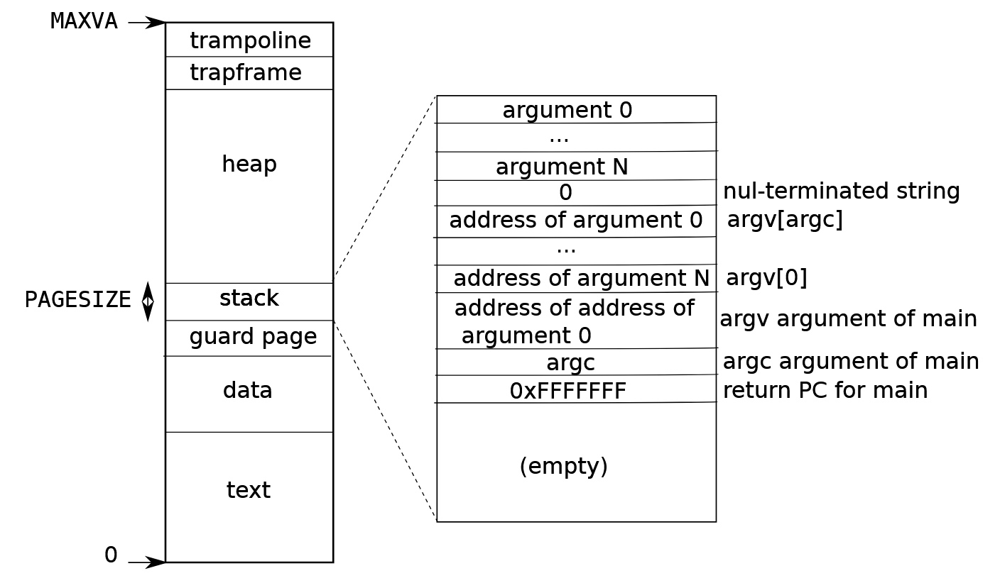
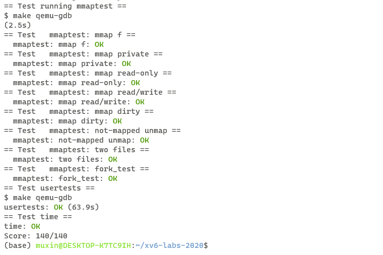

# xv6 labs
## **lab10**:mmap
**任务：**

为xv6添加mmap和munmap系统调用，实现内存映射文件。

**实现：**

首先考虑将文件映射在虚拟空间的哪个位置。

考虑到一个进程的虚拟空间分布：



栈空间是向上生长的，为了尽量避免映射文件和用户空间的冲突，我们选择在尽可能高的空间来映射文件，也就是从trapframe下方开始映射，向下生长。

需要添加一些新的数据结构来维护mmap相关的信息。

首先定义VMA结构体，来维护每一个虚拟映射区域的相关信息，每一个进程最多有16个虚拟映射区域，因此，在proc结构体中添加一个VMA数组：

```c
struct VMA
{
    int         valid;
    struct file *file;
    uint64       address;
    uint64      length;
    int         prot;
    int         flags;
    uint64      offset;
    uint64      mapcnt;
};

struct proc {
  // ...
+ struct VMA VMAs[16];              // virtual memory area
+ uint64 mmap_va;
  // ...
};

```
VMA中，valid表示该虚拟映射区域是否被使用，mapcnt负责维护当前被映射的字节数，在munmap时会减少mapcnt，当减为0时，关闭相应的文件。

proc中除了VMAs数组，额外增加一个变量mmap_va，来维护当前虚拟映射区域的最低地址，当需要分配新的虚拟映射区域时，从该地址下面进行分配，向下生长。mmap_va的初始值应该为 MAXVA-2*PGSIZE。

之后我们添加mmap和munmap系统调用，关于添加系统调用的方法不再赘述。

mmap的函数原型为 **char\* mmap(char\* address,uint64 length,int prot,int flags,int fd,uint64 offset)**;

address是希望映射到的虚拟地址，可以默认为0，也就是映射的虚拟地址由内核自己决定。length是映射的字节数，prot指示该映射权限，可读，可写或者可执行。flags表示映射内存需不需要写回。fd是要映射文件的文件描述符。offset表示映射开始的文件偏移量。返回虚拟映射区域的起始地址。

我们实现mmap系统调用的主体函数sys_mmap：

```c
uint64
sys_mmap(void){
  uint64 address,length,offset;
  int prot,flags,fd;
  struct file *file;

  if(argaddr(0,&address)<0 || argaddr(1,&length)<0 || argint(2,&prot)<0 
  || argint(3,&flags)<0 || argfd(4,&fd,&file)<0 || argaddr(5,&offset)<0){
    return -1;
  }
  if((prot & PROT_WRITE) && (flags & MAP_SHARED) && !(file->writable)){
    return -1;
  }
  struct proc *p = myproc();
  struct VMA *vma = 0;
  for(int i=0;i<16;++i){
    if(p->VMAs[i].valid == 0){
      vma = &p->VMAs[i];
      break;
    }
  }
  if(vma == 0){
    panic("no empty vma");
  }
  vma->valid = 1;
  vma->address = p->mmap_va-length;
  p->mmap_va -= length;
  vma->length = length;
  vma->file = file;
  vma->prot = prot;
  vma->flags = flags;
  vma->offset = offset;
  vma->mapcnt = length;
  filedup(file);
  return vma->address;
}
```

首先我们从16个VMA中寻找一个未使用的vma来记录相关信息。然后判断prot，flags和file权限的合理性。当prot是可写的，并且flags是MAP_SHARED，但是文件是不可写的时，不合理，返回-1。映射区域的起始地址应为mmap_va-length，与此同时需要更新mmap_va，对应虚拟映射区域的向下增长。vma的mapcnt应该初始化为length，表示length个字节被映射。同时，需要调用filedup函数，将file的引用数增加。最后返回vma->address，表示虚拟映射区域的起始地址。

在sys_mmap中，我们并不实际分配物理页来读取文件，也不在页表中加入对应虚拟地址，而是利用延迟分配的机制，当发生缺页中断时，才进行实际的物理页分配和虚拟地址映射。因此我们需要修改usertrap函数：

```c
void
usertrap(void)
{
  // ...
    else if((which_dev = devintr()) != 0){
    // ok
  } else if((r_scause() == 13 || r_scause() == 15)){
    uint64 va = r_stval();
    struct VMA *vma = 0;
    for(int i=0;i<16;++i){
      if(p->VMAs[i].valid && va >= p->VMAs[i].address && va<= p->VMAs[i].address+p->VMAs[i].length){
        vma = &p->VMAs[i];
        break;
      }
    }
    if(vma){
      char *mem;
      mem = kalloc();
      memset(mem, 0, PGSIZE);
      if(mappages(p->pagetable, va , PGSIZE, (uint64)mem, PTE_U | PTE_V | (vma->prot)<<1) != 0){
        kfree(mem);
        panic("mmap page fault map error");
      }
      vma_read(vma,mem,va);
    }
    else{
      printf("usertrap(): unexpected scause %p pid=%d\n", r_scause(), p->pid);
      printf("            sepc=%p stval=%p\n", r_sepc(), r_stval());
      p->killed = 1;
    }
  } else {
    printf("usertrap(): unexpected scause %p pid=%d\n", r_scause(), p->pid);
    printf("            sepc=%p stval=%p\n", r_sepc(), r_stval());
    p->killed = 1;
  }
  // ...
}
```

当发生缺页中断时，也就是r_scause()等于13或15时，我们需要判断是不是因为mmap引起的。首先在16个VMA中寻找是否有对应的虚拟映射区域，也就是引起缺页的虚拟地址是否在虚拟映射区域内。如果是的话，我们需要申请物理页，并在页表中添加虚拟页到物理页的映射，具体是通过mappages实现。需要注意的是页表中pte的标志位，pte中读写位分别为1和2，而prot的读写位分别为0和1，因此只需要给prot向左移位1就是对应pte的读写位。

之后我们调用vma_read函数从文件中读取到分配的物理页中，vma_read是自己定义的函数，定义在sysfile.c中:
```c
void vma_read(struct VMA *vma,char* mem,uint64 va){
  begin_op();
  ilock((vma->file)->ip);
  readi(vma->file->ip,0,(uint64)mem,vma->offset+PGROUNDDOWN(va)-vma->address,PGSIZE);
  iunlock((vma->file)->ip);
  end_op();
}
```
主要通过readi来读取文件，读取的偏移量应该为vma->offset+PGROUNDDOWN(va)-vma->address。

之后实现munmap系统调用。munmap的函数原型为**int munmap(char\* address, int length)**。

address为取消映射的起始地址，length为取消映射的字节数。

实现munmap系统调用的主体函数 sys_munmap:

```c
uint64
sys_munmap(void){
  uint64 addr,length;
  if(argaddr(0,&addr)<0 || argaddr(1,&length)<0){
    return -1;
  }
  struct proc *p = myproc();
  struct VMA *vma = 0;
  for(int i=0;i<16;++i){
    if(p->VMAs[i].valid && addr >= p->VMAs[i].address && addr < p->VMAs[i].address+p->VMAs[i].length){
      vma = &p->VMAs[i];
      break;
    }
  }
  if(vma == 0){
    panic("can't find the vma");
  }
  if(vma && walkaddr(p->pagetable, addr) != 0){
    if(vma->flags == MAP_SHARED){
      // write back
      filewriteoff(vma->file,addr,length,addr-vma->address);
    }
    // uvmunmap
    uvmunmap(p->pagetable,PGROUNDUP(addr),(length-(PGROUNDUP(addr)-addr))/PGSIZE,1);
    vma->mapcnt -= length;
    if(vma->mapcnt==0){
      fileclose(vma->file);
      vma->valid = 0;
    }
  }
  return 0;
}
```

首先找到address对应的虚拟映射区域，并且判断该虚拟地址是否还在页表映射中。之后判断该虚拟映射区域是否需要写回，如果需要，调用filewriteoff进行写回。然后取消虚拟地址映射，调用uvmunmap函数进行。最后减少虚拟映射区域的mapcnt，如果减少为0，那么关闭虚拟映射区域对应的文件，将vma的valid置零。

filewriteoff是仿照filewrite的一个自定义函数，实现在file.c中。原始的filewrite函数，只能从0偏移量处写回文件，filewriteoff可以从指定偏移量处写回文件:

```c
int filewriteoff(struct file *f, uint64 addr, int n , int off)
{
  int r, ret = 0;

  if(f->writable == 0)
    return -1;

  if(f->type == FD_INODE){
  int max = ((MAXOPBLOCKS-1-1-2) / 2) * BSIZE;
  int i = 0;
  while(i < n){
    int n1 = n - i;
    if(n1 > max)
      n1 = max;

    begin_op();
    ilock(f->ip);
    if ((r = writei(f->ip, 1, addr + i, off, n1)) > 0)
      off += r;
    iunlock(f->ip);
    end_op();

    if(r != n1){
      // error from writei
      break;
    }
    i += r;
  }
  ret = (i == n ? n : -1);
} else {
  panic("filewriteoff");
}
  return ret;
}
```

之后还需要修改exit和fork。对于exit，应该取消该进程的所有虚拟映射区域的映射：

```c
void
exit(int status)
{
  struct proc *p = myproc();

  for( int i=0 ; i<16; i++ )
   {
     if( p->VMAs[i].valid == 1 )
     {
       struct VMA* vp = &p->VMAs[i];
       for( uint64 addr = vp->address ; addr < vp->address  + vp->length ; addr += PGSIZE )
       {
         if( walkaddr( p->pagetable , addr ) != 0 )
         {
           if( vp->flags == MAP_SHARED )
             filewriteoff( vp->file , addr , PGSIZE , addr-vp->address );
           uvmunmap( p->pagetable , addr , 1 , 1 );
         }
       }
       fileclose( p->VMAs[i].file );
       p->VMAs[i].valid = 0;
     }
   }
   // ...
}
```

同munmap的操作类似，对文件进行写回，对虚拟页进行unmap，关闭文件。

对于fork，子进程应该复制父进程的VMAs数组，但是不进行实际物理页的分配和复制，因为存在延迟分配的机制，后续子进程用到对应虚拟地址再进行分配。同时需要filedup对应文件，增加引用数。

**make grade 结果:**



**后记：**

这个lab实现了简单的mmap机制，虽然通过了所有的测试，但是测试较少，也没有关注一些特殊情况，代码应该还存在不少问题。

首先，没有考虑到虚拟空间的回收问题，在进行虚拟映射区域的分配时，起始地址永远是向下生长的，即使上面的虚拟映射区域被取消映射也无法回收。只能希望在进程结束之前，虚拟空间不会被用完。

其次，物理内存也存在泄露问题，在munmap时，可能存在unmap半页的情况，假如只unmap后半页，那么前半页还有可能被使用，所以整个物理页面都不应该被释放。但是之后再unmap前半页时，并不知道后半页已经被unmap，所以整个物理页面还是不会被释放。所以，整个页面永远不会被释放，存在内存泄露问题。

要解决这些问题，工作量应该挺大，时间有限，暂时不纠结。


