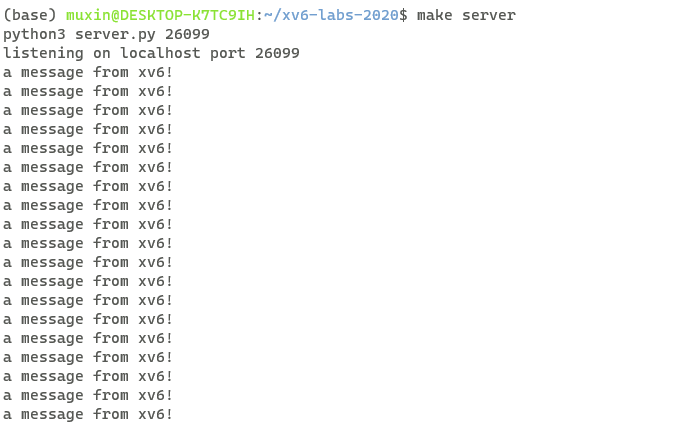
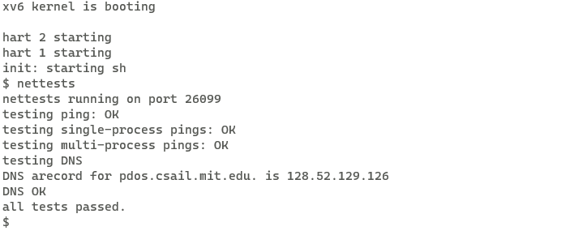
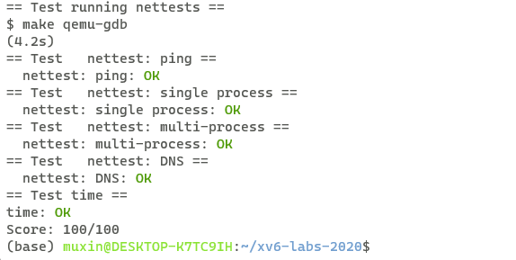

# xv6 labs
## **lab11**:networking
**任务：**

为网卡（NIC）写一个简易的xv6驱动程序。

lab中使用的网卡设备为E1000，qemu模拟了该硬件设备，xv6可以像操作真实硬件设备一样来操作该设备。同时，qemu还模拟了一个server，用于之后的测试，xv6和该server处于一个局域网中。

该lab的前置知识看似庞杂，实际大部分并不需要深入探究，只需要大致理解DMA的原理，以及部分关于E1000的细节。

内核会在内存中为E1000提供多个缓冲区，E1000可以将数据包写入其中，或者从缓冲区中读取。缓冲区被定义为mbuf结构体，每一个缓冲区由一个描述符来描述，描述符中包含缓冲区的数据地址，以及其他的信息。

发送和接收分别有16个缓冲区，这些缓冲区被组织成环状，也就是从末尾再向后就到开头。因此用数组tx_mbufs来保存发送缓冲区的指针，一共有16个元素，每个元素是一个指向mbufs结构体的指针。与之对应，数组tx_ring负责保存对应描述符，一共16个元素，每个元素是一个tx_desc结构体。接受缓冲区与之类似，也有rx_mbufs数组和rx_ring数组。

我们只需要实现e1000_transmit()和e1000_recv()函数，以供驱动程序可以发送和接受数据包。

**实现：**

e1000驱动程序的发送包原理大致为，当cpu希望发送mbuf指向的缓冲区的数据包时，驱动程序先找到tr_ring的尾部，该描述符会被作为下一个发送缓冲区的描述符。我们将该描述符原来指向的缓冲区释放，将mbuf作为该描述符现在指向的缓冲区，然后向描述符中填入其他信息然后更新tr_ring尾部。这样就告知了e1000有新的数据包待发送，之后e1000会使用DMA机制从内存中读取数据包并发送。

因此，e1000_transmit代码如下：
```c
int
e1000_transmit(struct mbuf *m)
{
  //
  // Your code here.
  //
  // the mbuf contains an ethernet frame; program it into
  // the TX descriptor ring so that the e1000 sends it. Stash
  // a pointer so that it can be freed after sending.
  //
  
  acquire(&e1000_lock);
  uint32 TDT = regs[E1000_TDT];
  struct tx_desc *desc = &tx_ring[TDT];
  if(!(desc->status & E1000_TXD_STAT_DD)){
    // E1000 hasn't finished the corresponding previous transmission request
    release(&e1000_lock);
    return -1;
  }
  if(tx_mbufs[TDT]){
    mbuffree(tx_mbufs[TDT]);
  }
  tx_mbufs[TDT] = m;
  desc->addr = (uint64)m->head;
  desc->length = m->len;
  desc->cmd = desc->cmd | E1000_TXD_CMD_EOP | E1000_TXD_CMD_RS;
  regs[E1000_TDT] = (TDT+1)%TX_RING_SIZE;
  release(&e1000_lock);
  return 0;
}
```

e1000_transmit可能会被多个进程同时调用，因此为了保护相关数据结构，需要在操作前获取e1000_lock。通过regs[E1000_TDT]来获取tr_ring的尾部。通过查看描述符的status字段的E1000_TXD_STAT_DD位来查看之前的附送请求是否完成，未完成则报错。需要注意，还需要设置描述符的cmd字段，这里只需要将E1000_TXD_CMD_EOP和E1000_TXD_CMD_RS置位。

e1000驱动程序的接收包原理大致为，首先需要找到下一个接收包在rx_ring中的索引（E1000_RDT寄存器的值向后移动一个位置），通过索引找到对应的mbuf，调用nex_rx()将mbuf传递到网络堆栈上。然后分配一个新的mbuf，将指针放入tx_mbufs中对应索引处，并将描述符指向新的mbuf。之后更新E1000_RDT的值。

因此，e1000_recv代码如下：

```c
static void
e1000_recv(void)
{
  //
  // Your code here.
  //
  // Check for packets that have arrived from the e1000
  // Create and deliver an mbuf for each packet (using net_rx()).
  //

  uint32 RDT = (regs[E1000_RDT]+1)%RX_RING_SIZE;
  while(rx_ring[RDT].status & E1000_RXD_STAT_DD){

    struct mbuf *b = rx_mbufs[RDT];
    b->len = rx_ring[RDT].length;
    net_rx(b);
    rx_mbufs[RDT] = mbufalloc(MBUF_DEFAULT_HEADROOM);
    memset(&rx_ring[RDT], 0, sizeof(rx_ring[RDT]));
    rx_ring[RDT].addr = (uint64)rx_mbufs[RDT]->head;
    regs[E1000_RDT] = RDT;
    RDT = (RDT+1)%RX_RING_SIZE;
  }
}
```
类似于e1000_transmit,这里通过判断rx_desc的status字段的E1000_RXD_STAT_DD来判断接受包是否可用。需要注意的是，e1000_recv不同于e1000_transmit，不会被多个进程调用，它负责接收所有进程接收的包，收到包后内核才会根据端口号将对应包转发给对应进程，因此，e1000_recv不存在并发的情况，不需要进行加锁。

**测试结果：**

server：



xv6:



**make grade 结果：**

