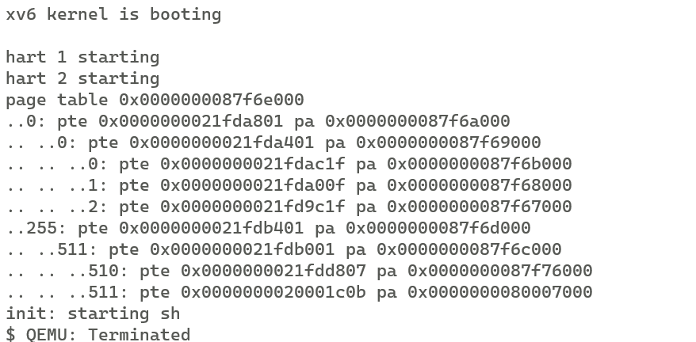
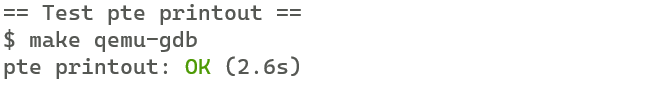
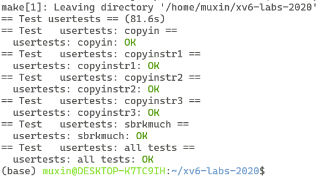
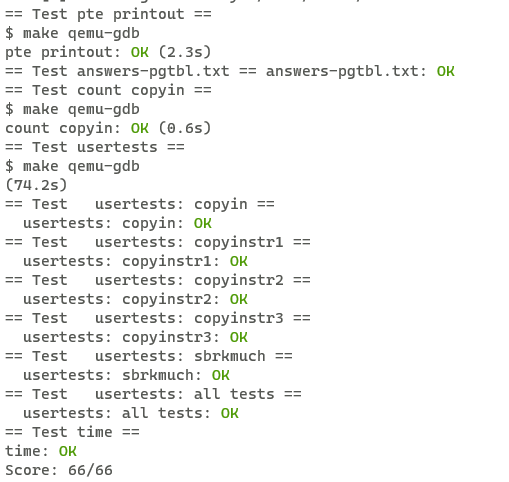

# xv6 labs
## **lab3**:page tables
### **Exercise1** Print a page table
**任务：**

定义一个名为vmprint() 的函数。它接受一个 pagetable_t 参数，将该参数指向的三级页表递归地打印出来，同时将该函数添加在exec.c中，使得在创建第一个进程时打印出对应的页表

**实现：**

定义辅助函数vmprint_level函数，根据页表地址和页表层级打印页表，同时递归地打印更低层次页表

```c
void vmprint(pagetable_t pagetable){
  printf("page table %p\n",pagetable);
  vmprint_level(pagetable,2);
}

void vmprint_level(pagetable_t pagetable,int level){
    // there are 2^9 = 512 PTEs in a page table.
  for(int i = 0; i < 512; i++){
    pte_t pte = pagetable[i];
    if((pte & PTE_V) && (pte & (PTE_R|PTE_W|PTE_X)) == 0){
      // this PTE points to a lower-level page table.
      printf("..");
      for(int j=0;j<3-level-1;++j){
        printf(" ..");
      }
      printf("%d: pte %p pa %p\n",i,pte,PTE2PA(pte));
      uint64 child = PTE2PA(pte);
      vmprint_level((pagetable_t)child,level-1);
    } else if(pte & PTE_V){
      printf("..");
      for(int j=0;j<3-level-1;++j){
        printf(" ..");
      }
      printf("%d: pte %p pa %p\n",i,pte,PTE2PA(pte));
    }
  }
}
```

**make grade 结果**：






### **Exercise2** A kernel page table per process 
**任务：**

修改内核，以便每个进程在内核中执行时都使用自己的内核页表副本。修改struct proc为每个进程维护一个内核页表，修改scheduler在切换进程时切换内核页表。

**实现：**

首先在proc.h中定义的struct proc中添加kernelpgtbl指向进程自己的内核页表

```c
 struct proc {
   uint64 kstack;               // Virtual address of kernel stack
   /*
   ...
   */
   char name[16];               // Process name (debugging)
+  pagetable_t kernelpgtbl;    
 };
```
之后在vm.c中实现kvminit_new()函数，该函数仿照kvminit()函数，创建一个进程自己的内核页表，并将内核空间中的虚拟地址映射到物理地址上
```c
pagetable_t
kvminit_new(){
  pagetable_t kernelpgtbl = (pagetable_t) kalloc();
  memset(kernelpgtbl, 0, PGSIZE);
  // uart registers
  kvmmap_new(kernelpgtbl, UART0, UART0, PGSIZE, PTE_R | PTE_W);

  // virtio mmio disk interface
  kvmmap_new(kernelpgtbl, VIRTIO0, VIRTIO0, PGSIZE, PTE_R | PTE_W);

  // CLINT
  //kvmmap_new(kernelpgtbl, CLINT, CLINT, 0x10000, PTE_R | PTE_W);

  // PLIC
  kvmmap_new(kernelpgtbl, PLIC, PLIC, 0x400000, PTE_R | PTE_W);

  // map kernel text executable and read-only.
  kvmmap_new(kernelpgtbl, KERNBASE, KERNBASE, (uint64)etext-KERNBASE, PTE_R | PTE_X);

  // map kernel data and the physical RAM we'll make use of.
  kvmmap_new(kernelpgtbl, (uint64)etext, (uint64)etext, PHYSTOP-(uint64)etext, PTE_R | PTE_W);

  // map the trampoline for trap entry/exit to
  // the highest virtual address in the kernel.
  kvmmap_new(kernelpgtbl, TRAMPOLINE, (uint64)trampoline, PGSIZE, PTE_R | PTE_X);
  return kernelpgtbl;
}
```
上面使用了kvmmap_new函数，相较于kvmmap函数，可以指定页表地址

```c
void
kvmmap_new(pagetable_t pagetable, uint64 va, uint64 pa, uint64 sz, int perm)
{
  if(mappages(pagetable, va, sz, pa, perm) != 0)
    panic("kvmmap_new");
}
```

同时定义可以指定页表地址的kvmap_new函数，将制定页表的虚拟地址转换为物理地址

```c
uint64
kvmpa_new(pagetable_t pagetable, uint64 va)
{
  //printf("kvmpa_new\n");
  uint64 off = va % PGSIZE;
  pte_t *pte;
  uint64 pa;
  
  pte = walk(pagetable, va, 0);
  if(pte == 0)
    panic("kvmpa");
  if((*pte & PTE_V) == 0)
    panic("kvmpa");
  pa = PTE2PA(*pte);
  return pa+off;
}
```
在proc.c中的allocproc函数为进程获得一个私有内核页表，并在内核页表上映射对应的内核栈

```c
static struct proc*
allocproc(void)
{
/*
...
*/
  // kernel page table
  p->kernelpgtbl = kvminit_new();
  char *pa = kalloc();
  if(pa == 0)
    panic("kalloc");
  uint64 va = KSTACK((int)(p-proc)); // 将内核栈映射到固定的逻辑地址上
  // printf("map krnlstack va: %p to pa: %p\n", va, pa);
  kvmmap_new(p->kernelpgtbl, va, (uint64)pa, PGSIZE, PTE_R | PTE_W);
  p->kstack = va;
  
  // Set up new context to start executing at forkret,
  // which returns to user space.
  memset(&p->context, 0, sizeof(p->context));
  p->context.ra = (uint64)forkret;
  p->context.sp = p->kstack + PGSIZE;

  return p;
}

删除掉proinit()函数中映射内核栈的过程

```c
void
procinit(void)
{
  struct proc *p;
  
  initlock(&pid_lock, "nextpid");
  for(p = proc; p < &proc[NPROC]; p++) {
      initlock(&p->lock, "proc");
  }
  kvminithart();
}
```

修改proc.c文件中的scheduler()函数，在调度到该进程时，将私有内核页表加载到satp寄存器上，同时刷新TLB，在退出进程时将全局内核页表加载到satp寄存器上
```c
void
scheduler(void)
{
  /*
  ...
  */
        w_satp(MAKE_SATP(p->kernelpgtbl));
        sfence_vma();

        swtch(&c->context, &p->context);

        kvminithart();
  /*
  ...
  */     
}
         
```
在freepro时释放进程的私有内核页表，但是不释放对应物理内存，同时释放掉对应的内核栈
```c
static void
freeproc(struct proc *p)
{
  /*
  ...
  */
  p->killed = 0;
  p->xstate = 0;

  void *kstack_pa = (void *)kvmpa_new(p->kernelpgtbl, p->kstack);
  kfree(kstack_pa);
  p->kstack = 0;

  kvm_free_kernelpgtbl(p->kernelpgtbl);
  p->kernelpgtbl = 0;

  p->state = UNUSED;
}
```

kvm_free_kernelpgtbl函数递归地释放页表，但不释放实际物理地址

```c
void
kvm_free_kernelpgtbl(pagetable_t pagetable)
{
  // there are 2^9 = 512 PTEs in a page table.
  for(int i = 0; i < 512; i++){
    pte_t pte = pagetable[i];
    uint64 child = PTE2PA(pte);
    if((pte & PTE_V) && (pte & (PTE_R|PTE_W|PTE_X)) == 0){ // 如果该页表项指向更低一级的页表
      
      kvm_free_kernelpgtbl((pagetable_t)child);
      pagetable[i] = 0;
    }
  }
  kfree((void*)pagetable); 
}
```
**make grade 结果：**



### **Exercise3** Simplify copyin/copyinstr 
**任务：**

将用户映射添加到每个进程的内核页表，以允许 copyin（和相关的字符串函数 copyinstr）直接解引用用户指针

**实现**

先定义两个辅助函数：kvmcopymappings负责页表映射的复制，后面将用户页表添加到私有内核页表时会使用到

```c
int
kvmcopymappings(pagetable_t src, pagetable_t dst, uint64 start, uint64 sz)
{
  pte_t *pte;
  uint64 pa, i;
  uint flags;

  
  for(i = PGROUNDUP(start); i < start + sz; i += PGSIZE){
    if((pte = walk(src, i, 0)) == 0)
      panic("kvmcopymappings: pte should exist");
    if((*pte & PTE_V) == 0)
      panic("kvmcopymappings: page not present");
    pa = PTE2PA(*pte);
    // `& ~PTE_U` 表示将该页的权限设置为非用户页
    // 必须设置该权限，RISC-V 中内核是无法直接访问用户页的。
    flags = PTE_FLAGS(*pte) & ~PTE_U;
    if(mappages(dst, i, PGSIZE, pa, flags) != 0){
      goto err;
    }
  }

  return 0;

 err:
  uvmunmap(dst, 0, i / PGSIZE, 0);
  return -1;
}
```

kvmdealloc函数类似于uvmdealloc函数，区别在于不释放实际的内存，用于释放私有内核页表的某些映射

```c
uint64
kvmdealloc(pagetable_t pagetable, uint64 oldsz, uint64 newsz)
{
  if(newsz >= oldsz)
    return oldsz;

  if(PGROUNDUP(newsz) < PGROUNDUP(oldsz)){
    int npages = (PGROUNDUP(oldsz) - PGROUNDUP(newsz)) / PGSIZE;
    uvmunmap(pagetable, PGROUNDUP(newsz), npages, 0);
  }

  return newsz;
}
```

在exec中对用户程序内存进行限制，用户程序内存不能超过PLIC，不然会和内核虚拟地址冲突

```c
int
exec(char *path, char **argv)
{
  /*
  ...
  */
    if((sz1 = uvmalloc(pagetable, sz, ph.vaddr + ph.memsz)) == 0)
      goto bad;
    if(sz1 >= PLIC){              
      goto bad;
    }
  /*
  ...
  */
}    
```
修改fork函数，确保用户页表和私有内核页表同步

```c
int
fork(void)
{
  /*
  ...
  */
  // Copy user memory from parent to child.
  if(uvmcopy(p->pagetable, np->pagetable, p->sz)<0 || kvmcopymappings(np->pagetable,np->kernelpgtbl,0,p->sz) < 0){
    freeproc(np);
    release(&np->lock);
    return -1;
  }
  /*
  ...
  */
}
```
修改exec函数
```c
int
exec(char *path, char **argv)
{
  /*
  ...
  */
  // Save program name for debugging.
  for(last=s=path; *s; s++)
    if(*s == '/')
      last = s+1;
  safestrcpy(p->name, last, sizeof(p->name));

  uvmunmap(p->kernelpgtbl, 0, PGROUNDUP(oldsz)/PGSIZE, 0);
  kvmcopymappings(pagetable, p->kernelpgtbl, 0, sz);
  /*
  ...
  */
}  
```

修改growproc函数

```c
int
growproc(int n)
{
  uint sz;
  struct proc *p = myproc();

  sz = p->sz;
  if(n > 0){
    uint64 newsz;
    if((newsz = uvmalloc(p->pagetable, sz, sz + n)) == 0) {
      return -1;
    }
    if(kvmcopymappings(p->pagetable, p->kernelpgtbl, sz, n) != 0) {
      uvmdealloc(p->pagetable, newsz, sz);
      return -1;
    }
    sz = newsz;
  } else if(n < 0){
    uvmdealloc(p->pagetable, sz, sz + n);
    sz = kvmdealloc(p->kernelpgtbl, sz, sz + n);
  }
  p->sz = sz;
  return 0;
}
```

修改userinit

```c
void
userinit(void)
{
  //...
  p->sz = PGSIZE;
  kvmcopymappings(p->pagetable, p->kernelpgtbl, 0, p->sz); 

  // prepare for the very first "return" from kernel to user.
  p->trapframe->epc = 0;      // user program counter
  p->trapframe->sp = PGSIZE;  // user stack pointer
  //...
}
```

最后修改copyin和copyinstr，调用新函数，使得可以直接解引用用户指针

```c
int
copyin(pagetable_t pagetable, char *dst, uint64 srcva, uint64 len)
{
  return copyin_new(pagetable, dst, srcva, len);
}

int
copyinstr(pagetable_t pagetable, char *dst, uint64 srcva, uint64 max)
{
  return copyinstr_new(pagetable, dst, srcva, max);
}
```

**make grade 结果**



**note**

根据lab的描述和xv6 book的描述，内核启动后，最低虚拟地址为PLIC，而CLINT的地址低于PLIC，因此，在对私有内核页表进行初始映射时，不需要映射CLINT，体现在vminit_new函数中

因为修改后的方案里，公共内核页表并没有内核栈，内核栈是定义在每个进程的私有内核页表中，因此影响到了XV6中的其他实现，需要相应的修改

例如virtio_disk.c中的virtio_disk_rw函数
```c
void
virtio_disk_rw(struct buf *b, int write)
{
  //...
  // buf0 is on a kernel stack, which is not direct mapped,
  // thus the call to kvmpa().
  disk.desc[idx[0]].addr = (uint64) kvmpa_new(myproc()->kernelpgtbl, (uint64) &buf0);
  disk.desc[idx[0]].len = sizeof(buf0);
  //...
}
```