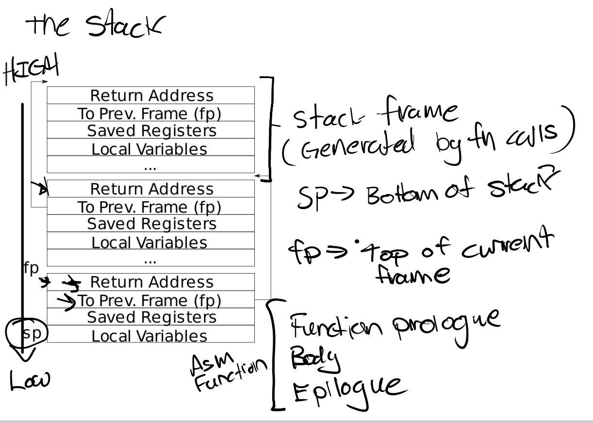
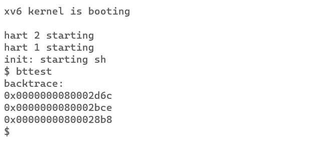
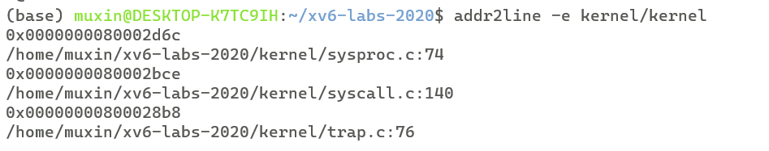
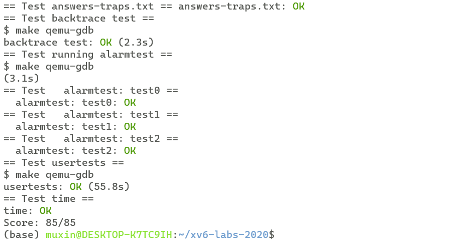

# xv6 labs
## **lab4**:traps
### **Exercise1** RISC-V assembly 
**任务：**
了解RISC-V汇编，略过

### **Exercise2** Backtrace
**任务：**

在printf.c中实现一个backtrace函数，遍历堆栈并在每个堆栈帧中打印保存的返回地址

**参考资料：**

堆栈的布局如下图所示

fp指向当前帧的顶部，在下方（-8）偏移量位置是返回地址，在下方（-16）偏移量位置是前一帧的fp指针

**实现：**

因为当前帧的fp保存在s0寄存器中，因此我们首先在riscv.h中实现r_fp函数，用来读取s0寄存器中的fp,该函数使用内联汇编来读取s0寄存器
```c
static inline uint64
r_fp()
{
  uint64 x;
  asm volatile("mv %0, s0" : "=r" (x) );
  return x;
}
```
接着，我们实现backtrace函数
```c
void
backtrace(void){
  uint64 fp = r_fp();
  uint64 ret_addr = *(uint64*)(fp-8);
  uint64 pre_fp = *(uint64*)(fp-16);
  printf("backtrace:\n");
  while(fp<PGROUNDUP(fp)){
    printf("%p\n",ret_addr);
    fp = pre_fp;
    ret_addr = *(uint64*)(fp-8);
    pre_fp = *(uint64*)(fp-16);
  }
}

```
之后，我们在sys_sleep中调用backtrace函数
```c
uint64
sys_sleep(void)
{
  int n;
  uint ticks0;

  if(argint(0, &n) < 0)
    return -1;
  acquire(&tickslock);
  ticks0 = ticks;
  while(ticks - ticks0 < n){
    if(myproc()->killed){
      release(&tickslock);
      return -1;
    }
    sleep(&ticks, &tickslock);
  }
  release(&tickslock);
+ backtrace();
  return 0;
}
```
我们可以将在panic函数中调用backtrace函数，当发生panic可以进行堆栈的回溯
```c
void
panic(char *s)
{
  pr.locking = 0;
  printf("panic: ");
  printf(s);
  printf("\n");
+ backtrace();
  panicked = 1; // freeze uart output from other CPUs
  for(;;)
    ;
}
```
**测试结果：**

我们运行bttest



可以看到backtrace输出了堆栈上的返回地址

通过运行 addr2line -e kernel/kernel可以查看对应的c实现位置



### **Exercise3** Alarm
**任务：**

实现两个系统调用，分别是sigalarm(interval,handler)和sigreturn。当sigalarm被调用时，该用户进程每过interval个ticks后都会调用一次handler，当handler返回时，用户进程需要恢复成之前的状态，由sigreturn完成。

**实现：**

添加系统调用的步骤参见lab2，在此不再赘述

两个系统调用的函数类型如下(在user.h中声明)：

```c
int sigalarm(int ticks, void (*handler)());
int sigreturn(void);
```

在proc.h中给proc结构体添加新的filed，来维护alarm过程中相关的信息：

```c
struct proc {
  struct spinlock lock;

  // p->lock must be held when using these:
  enum procstate state;        // Process state
  struct proc *parent;         // Parent process
  void *chan;                  // If non-zero, sleeping on chan
  int killed;                  // If non-zero, have been killed
  int xstate;                  // Exit status to be returned to parent's wait
  int pid;                     // Process ID

  // these are private to the process, so p->lock need not be held.
  uint64 kstack;               // Virtual address of kernel stack
  uint64 sz;                   // Size of process memory (bytes)
  pagetable_t pagetable;       // User page table
  struct trapframe *trapframe; // data page for trampoline.S 
+ struct trapframe *alarmtrapframe;  //save trapframe when run alarm_handler
  struct context context;      // swtch() here to run process
  struct file *ofile[NOFILE];  // Open files
  struct inode *cwd;           // Current directory
  char name[16];               // Process name (debugging)
+ int alarm_ticks;             //sigalarm ticks
+ void  (*alarm_handler)();        //sigalarm handler
+ int passed_ticks;            //sigalarm passed ticks
+ int handler_ret;             //if a handler hasn't returned yet
};

```

其中，alarm_ticks记录进程alarm的周期ticks数；alarm_handler是进程alarm时调用的函数指针；passed_ticks负责记录进程已经经过的ticks数；在test2中规定，在上一次handler被调用后未返回前不得再次调用handler，因此需要handler_ret负责记录进程上一次调用handler后返回了没有。

需要注意，在进行alarm时，进程的trapfram会改变，但是在alarm结束后，需要将进程恢复成之前的状态，因此，我们需要alarmtrapfram来保存之前的trapfram。

相应的，我们需要更改allocproc和freeproc来初始化和释放新增filed：

```c
static struct proc*
allocproc(void)
{
    //...
    // Allocate a trapframe page.
  if((p->trapframe = (struct trapframe *)kalloc()) == 0){
    release(&p->lock);
    return 0;
  }
  // Allocate a alarmtrapframe page.
+ if((p->alarmtrapframe = (struct trapframe *)kalloc()) == 0){
+   release(&p->lock);
+   return 0;
+ }
  //...
+ p->alarm_ticks = 0;
+ p->alarm_handler = 0;
+ p->passed_ticks = 0;
+ p->handler_ret = 1;
  return p;
}
```

```c
static void
freeproc(struct proc *p)
{
  if(p->trapframe)
    kfree((void*)p->trapframe);
+ if(p->alarmtrapframe)
+   kfree((void*)p->alarmtrapframe);
//...
}
```

在sysproc.c中实现sigalarm系统调用的主体函数sys_sigalarm：
```c
uint64
sys_sigalarm(void){
  int ticks;
  if(argint(0,&ticks)<0){
    return -1;
  }
  myproc()->alarm_ticks = ticks;
  uint64 handler;
  if(argaddr(1,&handler)<0){
    return -1;
  }
  myproc()->alarm_handler = (void(*)())handler;
  return 0;
}
```
sys_sigalarm将系统调用传入的ticks和handler参数赋给proc结构体中的alarm_ticks和alarm_handler

修改trap.c中的usertrap函数：

```c
void
usertrap(void)
{
    //...
    // give up the CPU if this is a timer interrupt.
  if(which_dev == 2){
    p->passed_ticks += 1;
    if(p->passed_ticks == p->alarm_ticks){
      p->passed_ticks = 0;
      if(p->handler_ret){
        p->handler_ret = 0;
        *p->alarmtrapframe = *p->trapframe;
        p->trapframe->epc = (uint64)p->alarm_handler;
      }
    }
    yield();
    //...
  }
  //...
}
```
每当发生一次timer interrupt时，将进程的passed_ticks加一。当passed_ticks等于alarm_ticks时，触发alarm，我们将passed_ticks置零；判断上一次handler是否已经返回，如果已经返回，我们将handler_ret置0；将trapfram保存在alarmtrapfram中；将trapfram的epc指向alarm_handler的起始位置

当handler执行完后，在返回前会调用sigreturn系统调用，我们在sysproc.c中实现sigreturn系统调用的主体函数sys_sigreturn：
```c
uint64
sys_sigreturn(void){
  *(myproc()->trapframe) = *(myproc()->alarmtrapframe);
  myproc()->handler_ret = 1;
  return 0;
}
```
将之前保存的alarmtrapframe赋给trapframe，将用户进程恢复成alarm之前的样子；并将handler_ret置1，说明此次handler调用已经返回。

**make grade 结果：**



