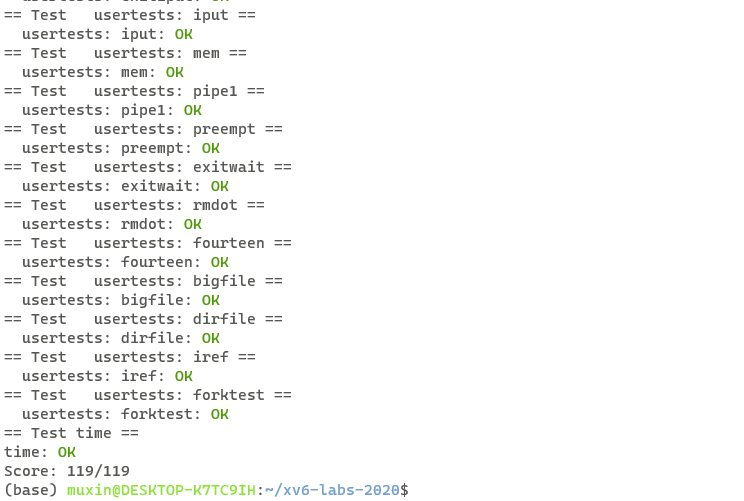

# xv6 labs
## **lab5**:lazy page allocation
**任务：**

实现xv6的用户堆内存的页面延迟分配。具体来说，用户程序通过sbrk()系统调用来请求堆内存，我们需要修改sbrk()，使得在一开始并不分配实际的内存空间，当真正使用某一未实际分配的虚拟地址时，会引起页面错误，此时再进行实际的分配

**实现：**

我们首先修改sbrk()系统调用：
```c
uint64
sys_sbrk(void)
{
  int addr;
  int n;
  struct proc* p = myproc();

  if(argint(0, &n) < 0)
    return -1;
  addr = p->sz;
  if(n<0){
    uvmdealloc(p->pagetable, p->sz, p->sz+n);
  }
  p->sz += n;
  return addr;
}
```
当进行内存的扩大时，我们不实际分配内存，仅仅扩大进程对应proc结构体中的sz，当进行内存的缩小时，我们直接调用uvmdealloc进行内存的释放

之后我们实现一个函数来实现虚拟地址对应的页面的实际分配：

```c
// 对已经延迟分配的地址进行实际分配
void realallocation(uint64 va){
  va = PGROUNDDOWN(va);
  char *mem = kalloc();
  struct proc* p = myproc();
  if(mem == 0){
  exit(-1);
  }
  memset(mem, 0, PGSIZE);
  if(mappages(p->pagetable, va, PGSIZE, (uint64)mem, PTE_W|PTE_X|PTE_R|PTE_U) != 0){
  kfree(mem);
  exit(-1);
  }
}
```
该函数参考procgrow函数，通过PGROUNDDOWN获取虚拟地址对应的页面起始地址，通过kalloc申请物理内存，通过mappages将虚拟地址映射到物理地址上

之后我们需要判断当发生页面错误时，是否应该对对应页面进行实际分配，实现函数shouldrealalloc：
```c
// 判断虚拟地址是否应该进行实际分配
int shouldrealalloc(uint64 va){
  struct proc* p = myproc();
  pte_t* pte;
  return (va<p->sz) 
  && !(va>=PGROUNDDOWN(p->trapframe->sp)-PGSIZE && va<PGROUNDDOWN(p->trapframe->sp))
  && (((pte = walk(p->pagetable, va, 0))==0) || ((*pte & PTE_V)==0));
}
```
当发生页面错误时，并不一定是由于延迟分配引起的，需要进行判断。判断一个页面错误是由于延迟分配引起的，条件有三个，一是引起页面错误的虚拟地址小于进程的大小，二是虚拟地址不在用户栈下的guard page，三是该虚拟地址对应页面在用户页表中不存在或者无效。

用户地址空间：


发生页面错误时会引发trap，我们需要在usertrap中调用realallocation，当页面错误是由于延迟分配引起时，我们需要进行实际分配：
```c
void
usertrap(void)
{
    //...
    if(r_scause() == 8){
    // system call
    // ...
    syscall();
  } else if((which_dev = devintr()) != 0){
    // ok
  } else if((r_scause() == 15 || r_scause() == 13) && shouldrealalloc(r_stval())){
    uint64 va = r_stval();
    realallocation(va);
  } 
  else {
    printf("usertrap(): unexpected scause %p pid=%d\n", r_scause(), p->pid);
    printf("            sepc=%p stval=%p\n", r_sepc(), r_stval());
    p->killed = 1;
  }
```

当scause寄存器中的值为15或者13时，说明发生了页面错误，此时我们调用shouldrealalloc()判断是否应该进行实际分配，如果需要分配则调用realallocation()进行实际的页面分配

需要注意，由于页面的延迟分配，会导致在调用uvmunmap来移除页面映射时去移除未实际分配的页面，可能会产生panic，需要修改uvmunmap：

```c
void
uvmunmap(pagetable_t pagetable, uint64 va, uint64 npages, int do_free)
{
  uint64 a;
  pte_t *pte;

  if((va % PGSIZE) != 0)
    panic("uvmunmap: not aligned");

  for(a = va; a < va + npages*PGSIZE; a += PGSIZE){
    if((pte = walk(pagetable, a, 0)) == 0)
      //panic("uvmunmap: walk");
      continue;
    if((*pte & PTE_V) == 0)
      //panic("uvmunmap: not mapped");
      continue;
    if(PTE_FLAGS(*pte) == PTE_V)
      panic("uvmunmap: not a leaf");
    if(do_free){
      uint64 pa = PTE2PA(*pte);
      kfree((void*)pa);
    }
    *pte = 0;
  }
}
```

由于页面的延迟分配，一些页面并未实际分配，因此页表中不含有该页表项或者页表项无效，在之前会产生相应的panic，现在不产生panic，仅仅跳过该页面

同样的，uvmcopy存在类似的问题，在fork()时，会调用uvmcopy为子进程复制父进程的页表，但是一些页面并未实际分配，所以页表中没有对应的页表项，或者页表项无效：

```c
int
uvmcopy(pagetable_t old, pagetable_t new, uint64 sz)
{
  pte_t *pte;
  uint64 pa, i;
  uint flags;
  char *mem;

  for(i = 0; i < sz; i += PGSIZE){
    if((pte = walk(old, i, 0)) == 0)
      //panic("uvmcopy: pte should exist");
      continue;
    if((*pte & PTE_V) == 0)
      //panic("uvmcopy: page not present");
      continue;
    pa = PTE2PA(*pte);
    flags = PTE_FLAGS(*pte);
    if((mem = kalloc()) == 0)
      goto err;
    memmove(mem, (char*)pa, PGSIZE);
    if(mappages(new, i, PGSIZE, (uint64)mem, flags) != 0){
      kfree(mem);
      goto err;
    }
  }
  return 0;

 err:
  uvmunmap(new, 0, i / PGSIZE, 1);
  return -1;
}
```
之前会产生panic，修改后不产生panic，仅仅跳过该页面

最后一个问题，当对未实际分配的虚拟地址进行read和write系统调用时，会产生错误。分析read和write系统调用的源码，可以发现最终是通过copyin和copyout函数来实现内核数据和用户数据的交换，因此，我们只需要在copyin和copyout前对虚拟地址进行判断，如果需要进行实际分配，则调用realallocation进行分配：
```c
int
copyout(pagetable_t pagetable, uint64 dstva, char *src, uint64 len)
{
  if(shouldrealalloc(dstva)){
    realallocation(dstva);
  }
  //...
}
```

```c
int
copyin(pagetable_t pagetable, char *dst, uint64 srcva, uint64 len)
{
  if(shouldrealalloc(srcva)){
    realallocation(srcva);
  }
  //...
}
```
**make grade 结果：**
