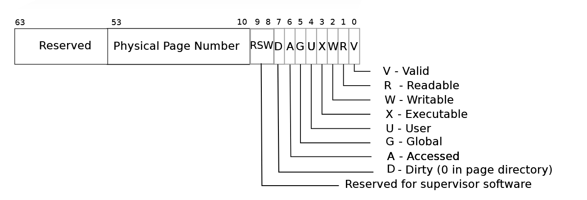
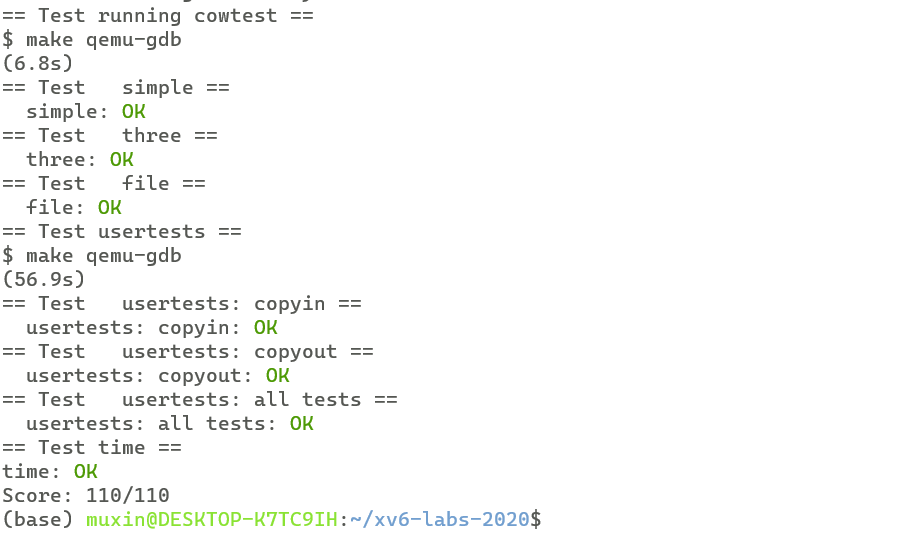

# xv6 labs
## **lab6**:Copy-on-Write Fork for xv6
**任务：**

实现fork()的写时复制

**整体思路：**

之前的fork，会在创建子进程时，将父进程的所有物理页为子进程复制一份，如果要实现写时复制，在创建子进程时，只需要让子进程页表的pte指向父进程的物理页，而并不真正分配物理页，同时将父子进程的pte标记为只读。

当某一进程需要对COW页面进行写时，会引起页面错误，此时分配新的物理页，将原来页面内容复制过来，将pte标记为可写。

引入COW机制后，一个物理页面可能被几个进程所引用，为了保证物理页面正确被释放，我们需要为每一个物理页维护一个引用数，只有当引用数减为0时，才能真正释放该物理页。

**实现：**

首先修改uvmcopy函数，fork系统调用会调用uvmcopy函数将父进程的用户空间复制给子进程，我们将复制方法修改为写时复制：
```c
int
uvmcopy(pagetable_t old, pagetable_t new, uint64 sz)
{
  pte_t *pte;
  uint64 pa, i;
  uint flags;

  for(i = 0; i < sz; i += PGSIZE){
    if((pte = walk(old, i, 0)) == 0)
      panic("uvmcopy: pte should exist");
    if((*pte & PTE_V) == 0)
      panic("uvmcopy: page not present");
    pa = PTE2PA(*pte);
    if(*pte & PTE_W){
      *pte = ((*pte)|PTE_COW)&(~PTE_W);
    }
    flags = PTE_FLAGS(*pte);
    if(mappages(new, i, PGSIZE, (uint64)pa, flags) != 0){
      goto err;
    }
    acquire(&refcountlock);
    refcount[(pa-KERNBASE)/PGSIZE]++;
    release(&refcountlock);
  }
  return 0;

 err:
  uvmunmap(new, 0, i / PGSIZE, 1);
  return -1;
}
```
之前的uvmcopy会申请新的物理页面，并将其映射在子进程页表上，这里我们直接将父进程的物理页面映射到子进程页表上，同时，将父子进程的pte都标记为不可写以及COW页面，我们使用xv6预留的pte位来标识一个页面是否为COW页面：
```c
#define PTE_COW (1L << 8) //cow
```

这里需要注意，不能将所有页面都做只读和COW标记。试想，对于一个原本的只读页面，如果将它标记为COW，那么当尝试对它进行写时，它会被误以为是一个可写的COW页，那么内核会对它进行真正的复制，并开放可写，此时它变成了一个可写的页面，这显然是不正确的。因此，我们只对原本可写的页面进行标记

接下来我们介绍refcountlock和refcount

前面提到，我们需要维护用户进程可能用到的每一个物理页面的引用数，根据xv6的物理内存空间分布：


只有从KERNBASE到PHYSTOP间的物理内存有可能会被用户进程使用，因此我们只需要维护一个大小为 **(KERNBASE-PHYSTOP)/PGSIZE** 的int数组来记录每个物理页面的引用数:
```c
int refcount[(uint64)(PHYSTOP-KERNBASE)/PGSIZE] = {0};
```
在fork时、对COW页面进行真实复制时还有kfree时等多个过程中都需要修改refcount数组，在某些情况下会产生竞态条件，一些执行时序会产生错误，因此在对refcount进行操作前需要加锁，定义一个自旋锁refcountlock：

```c
struct spinlock refcountlock;
```
在kinit时初始化锁:
```c
void
kinit()
{
  initlock(&kmem.lock, "kmem");
  initlock(&refcountlock, "refcount");
  freerange(end, (void*)PHYSTOP);
}
```

回看uvmcopy中对于refcount的操作，因为我们直接将父进程的物理页面映射在子进程的页表中，因此对应物理页面的引用次数需要加一，在操作前需要获取锁，操作后释放锁

我们需要实现函数shouldrealcopy函数来判断发生页面错误时，是否是由于COW引起的：
```c
int shouldrealcopy(uint64 va){
  struct proc* p = myproc();
  pte_t* pte;
  return (va<p->sz) 
  && ((pte=walk(p->pagetable, va, 0)) != 0)
  && (*pte & PTE_V)
  && (*pte & PTE_COW);
}
```
如果页面错误是由于COW引起的，那么对应页面应该 1:小于进程的大小 2：页表中有对应页表项 3：页表项有效 4：pte被标记为COW

再实现函数realcopy，来为COW页面进行真实的复制：

```c
int realcopy(uint64 va){
  struct proc* p = myproc();
  va = PGROUNDDOWN(va);
  pte_t *pte = walk(p->pagetable,va,0);
  uint flags = PTE_FLAGS(*pte);
  char *old_pa = (char *)PTE2PA(*pte);
  acquire(&refcountlock);
  if(refcount[((uint64)old_pa-KERNBASE)/PGSIZE]==1){
    *pte = (*pte|PTE_W)&(~PTE_COW);
    release(&refcountlock);
    return 0;
  }
  char *new_pa = kalloc();
  if(new_pa == 0){
    release(&refcountlock);
    return -1;
  }

  memmove(new_pa, old_pa, PGSIZE);
  *pte = (PA2PTE(new_pa)|flags|PTE_W)&(~PTE_COW);
  refcount[((uint64)old_pa-KERNBASE)/PGSIZE]--;
  release(&refcountlock);
  return 0;
}
```

在对COW页面进行复制前，需要判断对应物理页面的引用数是否为1，当为1时，说明此时只有该COW页面在引用该物理页面，这是，我们不用也不能为其申请新的物理页面，这样会导致该物理页面失去引用，永远不会被释放。因此，我们只需修改pte，标记为可写，并清除COW，COW页面仍然对应之前的物理页面。

当引用数不为1时，我们通过kalloc申请新的物理页面，将pte的物理地址部分替换成新地址，标记为可写，清除COW标记。同时，需要将之前物理页面的引用数减一。当kalloc申请不到物理页面时返回-1。

修改usertrap函数，在由于COW引起页面错误时，进行真正的复制：
```c
void
usertrap(void)
{
    //...
    if(r_scause() == 8){
    // system call
    // ...
    syscall();
  } else if((which_dev = devintr()) != 0){
    // ok
  } else if((r_scause() == 13 || r_scause() == 15) && shouldrealcopy(r_stval())){
    uint64 va = r_stval();
    if(realcopy(va)<0){
      p->killed = 1;
    }
  }
  else {
    printf("usertrap(): unexpected scause %p pid=%d\n", r_scause(), p->pid);
    printf("            sepc=%p stval=%p\n", r_sepc(), r_stval());
    p->killed = 1;
  }
```
继续考虑物理页面引用数的维护，在通过kalloc申请物理页面时，需要将对应的refcount设为1：
```c
void *
kalloc(void)
{
  struct run *r;

  acquire(&kmem.lock);
  r = kmem.freelist;
  if(r)
    kmem.freelist = r->next;
  release(&kmem.lock);

  if(r){
    memset((char*)r, 5, PGSIZE); // fill with junk
    refcount[((uint64)r-KERNBASE)/PGSIZE] = 1;
  }
  return (void*)r;
}
```
在kfree释放物理页面时，只有当引用数小于等于0时，才真正的将其归还freelist，否则只减少引用数：
```c
void
kfree(void *pa)
{
  struct run *r;

  if(((uint64)pa % PGSIZE) != 0 || (char*)pa < end || (uint64)pa >= PHYSTOP)
    panic("kfree");

  acquire(&refcountlock);

  if(--refcount[((uint64)pa-KERNBASE)/PGSIZE]<=0){
    // Fill with junk to catch dangling refs.
    memset(pa, 1, PGSIZE);

    r = (struct run*)pa;

    acquire(&kmem.lock);
    r->next = kmem.freelist;
    kmem.freelist = r;
    release(&kmem.lock);
  }
  release(&refcountlock);
}
```
需要注意，这里的判断条件必须为小于等于0，而不能为等于0，因为在内核初始化时，freelist为空，内核通过freerange函数调用kfree函数来构建freelist，这时引用数会被减为-1

最后我们需要考虑copyout，copyout也可能会对COW页面进行写入，但是不会产生页面错误，因此我们需要对写入的每个页面单独进行判断：
```c
int
copyout(pagetable_t pagetable, uint64 dstva, char *src, uint64 len)
{
  uint64 n, va0, pa0;

  while(len > 0){
    if(shouldrealcopy(dstva)){
        realcopy(dstva);
    }
    va0 = PGROUNDDOWN(dstva);
    pa0 = walkaddr(pagetable, va0);
    if(pa0 == 0)
      return -1;
    n = PGSIZE - (dstva - va0);
    if(n > len)
      n = len;
    memmove((void *)(pa0 + (dstva - va0)), src, n);

    len -= n;
    src += n;
    dstva = va0 + PGSIZE;
  }
  return 0;
}
```

**make grade 结果：**




