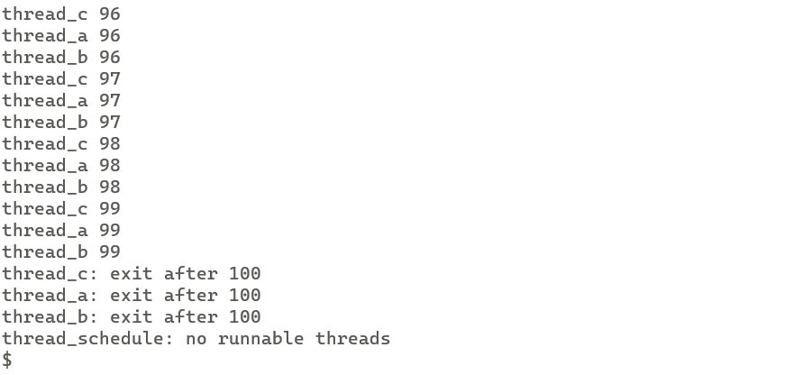
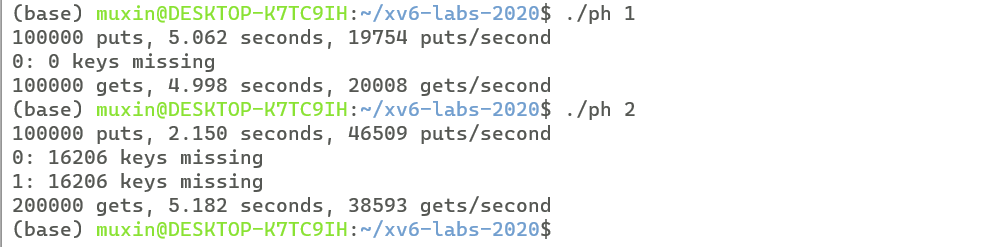
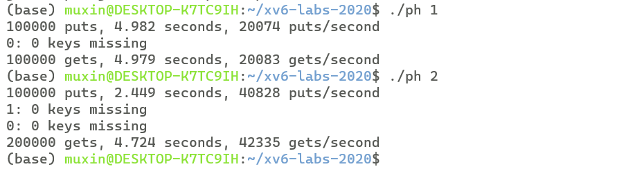
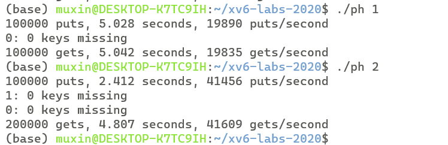
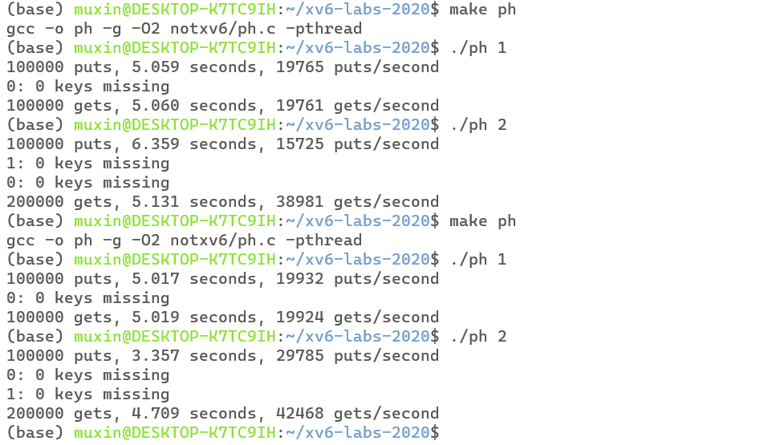
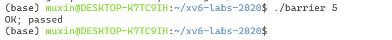
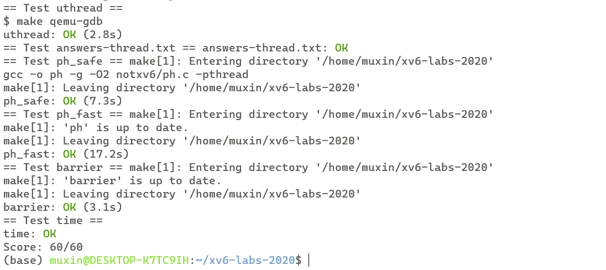

# xv6 labs
## **lab7**:Multithreading
### **Exercise1** Uthread: switching between threads 

**任务：**

为用户级线程系统设计上下文切换机制，并实现它。大部分代码已经给出，只需要补充uthread.c中的thread_create()和thread_scheduler()以及uthread_switch.S 中的 thread_switch

**实现：**

阅读已经给出的部分代码可以得知，该用户级线程的调度流程大概为：正在运行的线程想放弃cpu时，调用thread_yield()函数，将线程状态置为RUNNABLE，然后调用thread_schedule()函数进行线程的调度。thread_schedule()会从现有线程中挑选一个可以运行的线程作为next_thread，然后线程的上下文，因此在切换线程之前，我们需要保存线程的上下文，这里我们仿照xv6内核，为每个thread添加一个结构体context，用来保存线程的寄存器状态：
```c
struct context {
  uint64 ra;
  uint64 sp;

  // callee-saved
  uint64 s0;
  uint64 s1;
  uint64 s2;
  uint64 s3;
  uint64 s4;
  uint64 s5;
  uint64 s6;
  uint64 s7;
  uint64 s8;
  uint64 s9;
  uint64 s10;
  uint64 s11;
};

struct thread {
+ struct context context;
  char       stack[STACK_SIZE]; /* the thread's stack */
  int        state;             /* FREE, RUNNING, RUNNABLE */

};
```
由于进行上下文切换时，是通过调用thread_switch()函数实现的，因此一定是发生在函数调用的边界的，thread_switch()返回时会从堆栈中恢复 caller-saved 的寄存器，我们只需要保存callee-saved寄存器，context结构体的定义同xv6内核中proc中的context结构体

我们在thread_schedule()中调用thread_switch来切换当前线程和下一个线程的context：

```c
void 
thread_schedule(void)
{

    // ...
    if (current_thread != next_thread) {         /* switch threads?  */
    next_thread->state = RUNNING;
    t = current_thread;
    current_thread = next_thread;
    /* YOUR CODE HERE
     * Invoke thread_switch to switch from t to next_thread:
     * thread_switch(??, ??);
     */
+  thread_switch((uint64)(&t->context),(uint64)(&current_thread->context));
  } else
    next_thread = 0;
}
```

thread_switch的功能同进程切换时的swtch，直接copy:

```assembly
	.text

	/*
         * save the old thread's registers,
         * restore the new thread's registers.
         */

	.globl thread_switch
thread_switch:
	/* YOUR CODE HERE */
	sd ra, 0(a0)
	sd sp, 8(a0)
	sd s0, 16(a0)
	sd s1, 24(a0)
	sd s2, 32(a0)
	sd s3, 40(a0)
	sd s4, 48(a0)
	sd s5, 56(a0)
	sd s6, 64(a0)
	sd s7, 72(a0)
	sd s8, 80(a0)
	sd s9, 88(a0)
	sd s10, 96(a0)
	sd s11, 104(a0)

	ld ra, 0(a1)
	ld sp, 8(a1)
	ld s0, 16(a1)
	ld s1, 24(a1)
	ld s2, 32(a1)
	ld s3, 40(a1)
	ld s4, 48(a1)
	ld s5, 56(a1)
	ld s6, 64(a1)
	ld s7, 72(a1)
	ld s8, 80(a1)
	ld s9, 88(a1)
	ld s10, 96(a1)
	ld s11, 104(a1)
        
	ret    /* return to ra */

```

还需要补充thread_create，让线程在第一次被调度时正确执行：
```c
void 
thread_create(void (*func)())
{
  struct thread *t;

  for (t = all_thread; t < all_thread + MAX_THREAD; t++) {
    if (t->state == FREE) break;
  }
  t->state = RUNNABLE;
  // YOUR CODE HERE
+ t->context.ra = (uint64)func;
+ t->context.sp = (uint64)(t->stack) + STACK_SIZE;
}
```
我们希望thread_create返回后就开始执行对应线程函数func的代码，因此将返回地址设置为func，也就是设置ra寄存器的值。每个thread结构体有一块stack，每个线程都运行在该stack上，因此我们将sp寄存器设置为stack的栈底

**测试结果:**

运行uthread



### **Exercise2** Using threads 

**任务：**

在notxv6/ph.c中实现了一个简单的哈希表，如果从单线程使用，该哈希表是正确的，如果从多线程使用，则是错误的，探究其中的原因，并修改相应代码，使得可以正确从多线程使用该哈希表，实现并发加速。此作业运行在真实物理机上，使用的是UNIX pthread线程库

**实现：**

ph.c会调用一个或多个线程来对哈希表进行put，之后会get所有本应该put进去的key，来查看是否有丢失key。ph.c接受一个参数，用来指定put的线程数，初始的ph.c运行结果如下：



可以看出调用两个线程时put速率确实有很大提升，但是却会有大量的key丢失

**分析原因：**

两个put线程可能会产生竞态（race）

一个可能会导致key丢失的例子：两个put线程插入的两个key具有同样的哈希值，
线程1和线程2都已经获取了指向对应桶的头指针，此时线程1首先调用insert向
对应桶使用头插法插入新的entry，并修改头指针。之后线程2也调用insert进行插入，但是此时
线程2持有的是桶的旧的头指针，它在旧的头指针上进行头插后并将新插入的entry
作为头指针。这样线程1插入的entry就会丢失，在查找时从桶的头指针遍历时并不
能遍历到这个entry。

为了消除竞态，我们使用pthread库的互斥锁来避免数据丢失，分析可知，只有在insert的过程中，才有可能会产生竞态，因此我们在调用insert的前后加锁和释放锁：

```c
+ pthread_mutex_t lock;

static 
void put(int key, int value)
{
  int i = key % NBUCKET;

  // is the key already present?
  // ...
  if(e){
    // update the existing key.
    e->value = value;
  } else {
    // the new is new.
+   pthread_mutex_lock(&lock);
    insert(key, value, &table[i], table[i]);
+   pthread_mutex_unlock(&lock);
  }
}

int
main(int argc, char *argv[])
{
  pthread_t *tha;
  void *value;
  double t1, t0;
+ pthread_mutex_init(&lock,NULL);
  // ...
}

```
**测试结果：**



可以看到成功使用多线程实现了并发加速，同时没有任何key丢失

再进行分析，当多个线程再对不同的桶进行insert时，其实是不会存在竞态的，但是我们仍然要求它们获得同一把锁，这样会降低性能。我们可以为每一个桶定义一把锁，当线程对某个桶进行insert时，只需要获得桶对应的锁，这样就降低了锁的粒度：

```c
+ pthread_mutex_t locks[NBUCKET];

static 
void put(int key, int value)
{
  int i = key % NBUCKET;

  // is the key already present?
  // ...
  if(e){
    // update the existing key.
    e->value = value;
  } else {
    // the new is new.
+   pthread_mutex_lock(&locks[i]);
    insert(key, value, &table[i], table[i]);
+   pthread_mutex_unlock(&locks[i]);
  }
}

int
main(int argc, char *argv[])
{
  pthread_t *tha;
  void *value;
  double t1, t0;
+ for(int i=0;i<NBUCKET;++i)
+   pthread_mutex_init(&locks[i],NULL);
  // ...
}

```
**测试结果：**



可以看到，相较于之前的单把锁，性能并无明显提升，这是因为put操作的大部分时间都用在遍历桶，而insert操作占据的时间很少，如果将加锁位置换到put函数的开头和结尾，会发现性能差距明显:

```c
static 
void put(int key, int value)
{
  int i = key % NBUCKET;
  pthread_mutex_lock(&lock);
  // is the key already present?
  struct entry *e = 0;
  for (e = table[i]; e != 0; e = e->next) {
    if (e->key == key)
      break;
  }
  if(e){
    // update the existing key.
    e->value = value;
  } else {
    // the new is new.
    insert(key, value, &table[i], table[i]); 
  }
  pthread_mutex_unlock(&lock);
}
```

**测试结果：**



上面是加单把锁的测试结果，下面是每个桶加锁的测试结果，多线程下性能提升明显

### **Exercise2** Barrier 

**任务：**

实现一个barrier:也就是程序中的一个点，所有参与线程都必须在这个点等待，知道所有的线程都到达这个点，需要使用到pthread的条件变量

**实现：**

分析barrier.c给出的代码，得知测试代码中每个线程for循环多个round，每一个循环会调用barrier()，等待所有线程到达，然后随机休眠一会，每个循环开始时会断言当前循环的round等于全局的round，因此我们需要在barrier()中统计已经到达线程数，并当所有线程都到达时增加全局round数:

```c
static void 
barrier()
{
  // YOUR CODE HERE
  //
  // Block until all threads have called barrier() and
  // then increment bstate.round.
  //
+ pthread_mutex_lock(&bstate.barrier_mutex);
+ if(++bstate.nthread == nthread){
+   bstate.round++;
+   bstate.nthread = 0;
+   pthread_cond_broadcast(&bstate.barrier_cond);
+ }
+ else{
+   pthread_cond_wait(&bstate.barrier_cond,&bstate.barrier_mutex);
+ }
+ pthread_mutex_unlock(&bstate.barrier_mutex);
}
```

在每次调用barrier时，我们需要增加到达barrier的线程数，也就是bstate.nthread，当它等于nthread时，我们需要将bstate.round加一并置零bstate.nthread，然后唤醒所有在睡眠的线程；当还有线程未到达时，我们让当前线程睡眠。

但是这整个过程是非原子的，多个线程之间可能存在竞态，因此我们需要加锁。使用之前定义的bstate.barrier_mutex加锁。线程睡眠时使用pthread_cond_wait(cond,mutex),这样保证睡眠过程是原子的（在睡眠完成前不会有唤醒操作），同时在睡眠后释放掉mutex（不然会一直持有mutex阻塞别的线程），在苏醒时再获取mutex。唤醒时使用pthread_cond_broadcast(cond)，可以唤醒睡眠在cond上的所有线程。之后在退出函数前，释放掉持有的锁

**测试结果：**



**make grade 结果：**

