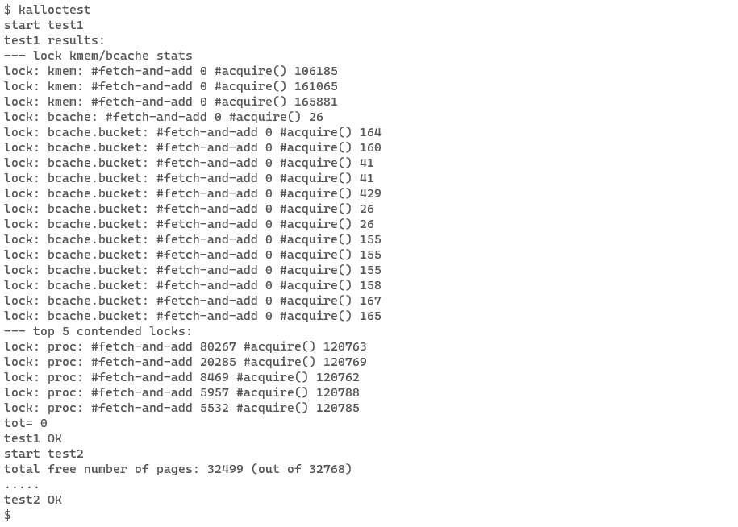
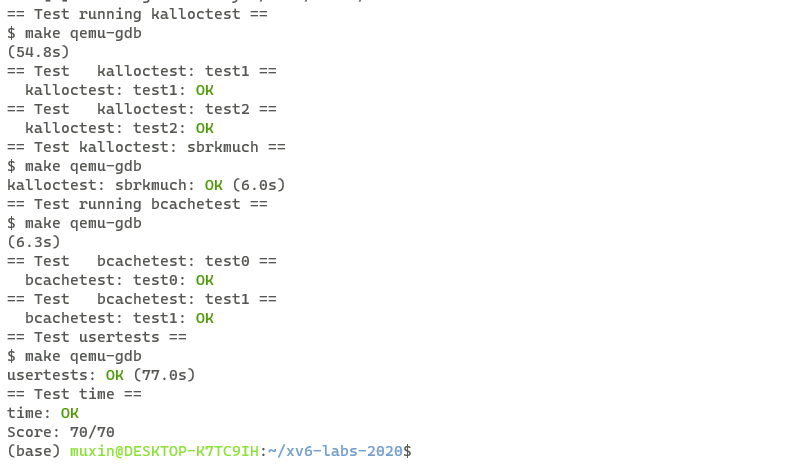

# xv6 labs
## **lab8**:locks
### **Exercise1** Memory allocator

**任务：**

user/kalloctest 会对xv6 的内存allocator进行压力测试：三个进程增大和缩小其地址空间，导致对 kalloc 和 kfree 的多次调用。 kalloc和kfree会争用kmem.lock。 kalloctest会打印锁的acuquire次数和由于争用引起的循环等待次数。

kmem.lock被争用的原因是所有空闲空间都被维护在一个空闲链表上，由单个锁保护，为了减少锁的争用，希望为每个cpu单独维护一个空闲链表，每个链表有自己的锁，不同cpu可以并发分配和释放空间，当一个cpu没有空闲空间，但其他cpu有时，必须进行空间窃取。

**实现：**

之前有一个全局的kmem结构体，里面有freelist和对应的lock，现在为每个cpu创建一个kmem结构体：

```c
struct kmem{
  struct spinlock lock;
  struct run *freelist;
};

struct kmem kmems[NCPU];
```
在kinit中需要为每个kmem的锁进行初始化：

```c
void
kinit()
{
  for(int i=0;i<NCPU;++i){
    initlock(&kmems[i].lock,"kmem");
  }
  freerange(end, (void*)PHYSTOP);
}
```

然后修改kalloc，在获取当前cpu的kmem的锁后，如果当前cpu的freelist还有空闲页，那么直接从freelist获取空闲页，然后释放对应锁。

在此之前，首先需要获取当前的cpu号，通过cpuid()获得，注意，当调用cpuid()时，需要关中断，否则返回结果是不可靠的：

```c
void *
kalloc(void)
{
  struct run *r;
  int cpu;
  push_off();
  cpu = cpuid();
  pop_off();
  acquire(&kmems[cpu].lock);
  r = kmems[cpu].freelist;
  if(r)
    kmems[cpu].freelist = r->next;
  release(&kmems[cpu].lock);

  if(r)
    memset((char*)r, 5, PGSIZE); // fill with junk
  else{ //steal from other cpu
    for(int i=0;i<NCPU;++i){
      if(i == cpu)
        continue;
      acquire(&kmems[i].lock);
      r = kmems[i].freelist;
      if(r)
        kmems[i].freelist = r->next;
      release(&kmems[i].lock);
      if(r)
        break;
    }
    if(r)
      memset((char*)r, 5, PGSIZE);
  }
  return (void*)r;
}

```

在当前cpu的freelist没有空闲页时，需要从别的cpu上进行窃取，通过遍历所有的cpu的freelist，找到一个空闲页后就将它从freelist上移除，退出循环，返回找到的空闲页。注意，在访问freelist前，需要获取对应的lock。

修改kfree:

```c
void
kfree(void *pa)
{
  struct run *r;

  if(((uint64)pa % PGSIZE) != 0 || (char*)pa < end || (uint64)pa >= PHYSTOP)
    panic("kfree");

  // Fill with junk to catch dangling refs.
  memset(pa, 1, PGSIZE);

  r = (struct run*)pa;
  int cpu;
  push_off();
  cpu = cpuid();
  pop_off();
  acquire(&kmems[cpu].lock);
  r->next = kmems[cpu].freelist;
  kmems[cpu].freelist = r;
  release(&kmems[cpu].lock);
}
```
修改后的kfree将空闲页返还到当前cpu对应的freelist上，同样的，在此之前需要通过cpuid()获取cpu号，同样需要关中断。

在kinit函数中，会调用freerange函数显式的释放一片空间，由于修改了kfree函数，调用freerange会将所有空闲页添加到调用freerange的cpu的freelist上，但是由于窃取空闲页机制的存在，因此其他cpu在需要空闲页时会从该cpu上窃取，因此我们不需要修改freerange。

**测试结果：**

所有kmem锁的争用都为0



### **Exercise2** Buffer cache

**任务：**

初始的xv6，所有buffer cache是维护在一个双向链表中，有一个单独的锁bcache.lock来保护这个双向链表，bget和brelse在获取buffer cache时，需要先获得bcache.lock。如果多个进程密集使用文件系统，它们可能会争夺 bcache.lock。

修改buffer cache的结构和对应的锁，来减少进程间对锁的争用，同时得保证每个block最多只有一个被cache的副本。

整体思想是使用每个哈希桶都有一个锁的哈希表来保存block号和实际buffer位置的对应关系，而不是像之前从双向链表中遍历来寻找对应block号的buffer。

**实现：**

考虑buf结构体的修改，之前所有的buf被组织成一个双向链表，因此需要有prev和next指针，现在不再需要。

而之前的双链表结构可以很方便的找到最近最少使用的buf，现在我们为每个buf维护一个last_use，方便寻找最近最少使用的buf：

```c
struct buf {
  int valid;   // has data been read from disk?
  int disk;    // does disk "own" buf?
  uint dev;
  uint blockno;
  struct sleeplock lock;
  uint refcnt;
+ uint lastuse;
- struct buf *prev; // LRU cache list
- struct buf *next;
  uchar data[BSIZE];
};

```

需要实现一个简易的哈希表，由于bget是根据dev和blockno来寻找对应的buf，我们可以将(dev<<32)+blockno （uint64）来作为key，将对应buf在buf数组中的下标（int）作为value，构建一个哈希表。哈希表的桶个数我们选取固定数目13，每个桶有对应的锁：

```c
#define NBUCKET 13

struct entry {
  uint64 key;
  int value;
  struct entry *next;
};
struct entry *table[NBUCKET];
struct entry entrys[NBUF];
struct spinlock locks[NBUCKET];

```

为方便起，我们在brelse时，并不将哈希表中的entry去除，而只是将对应buf的refcnt置为0。当需要cache一个新的block时，我们从哈希表中找到lastuse最小的，refcnt等于0的buf来cache，并修改对应entry的key值，将它移到对应的桶中。

因此，所有buf下标一定都在某个entry中，只不过对应的key值可能会变。因此，在最开始，我们将所有的buf下标都放到table[0]中：

```c
void
binit(void)
{
  struct buf *b;

  initlock(&bcache.eviction_lock, "bcache");

  for(b = bcache.buf; b < bcache.buf+NBUF; b++){
    initsleeplock(&b->lock, "buffer");
    b->lastuse = 0;
    b->refcnt = 0;
  }
  for(int i=0;i<NBUCKET;++i){
    initlock(&locks[i],"bcache.bucket");
  }

  // put all the buf in the table[0]
  for(int i=0;i<NBUF;++i){
    struct entry *e = &entrys[i];
    e->key = 0;
    e->value = i;
    e->next = table[0];
    table[0] = e;
  }
}
```

考虑bget的修改。首先需要判断要get的block是否已经被cache，之前是通过遍历双向链表来寻找，现在只需要在哈希表中查找。通过 **((uint64)dev<<32)+blockno** 来获取查找的key，然后得到所在的桶编号 **i**，在该桶中查找时需要先获得对应的锁 **locks[i]**。如果查找到了,则释放掉锁 **locks[i]**，直接将找到的buf返回：

```c
static struct buf*
bget(uint dev, uint blockno)
{
  struct buf *b;

  // Is the block already cached?
  uint64 dev_blockno = ((uint64)dev<<32)+blockno;
  struct entry* e;

  int i = dev_blockno % NBUCKET;

  acquire(&locks[i]);
  for (e = table[i]; e != 0; e = e->next) {
    if (e->key == dev_blockno) break;
  }

  if(e){
    b = &bcache.buf[e->value];
    b->refcnt++;
    release(&locks[i]);
    acquiresleep(&b->lock);
    return b;
  }
```
考虑如果block还未被cache的情况。

一个较为直观的想法是，在未cache的情况下，通过遍历所有桶的所有entry，找到一个last_use最小的并且refcnt等于0的buf。
在遍历每个桶前，获取该桶的锁，在遍历完成后，释放该锁。
最后将最终找到的buf所在entry的key值修改，并移到正确的桶中。设置buf的属性，返回buf。

但这种直观的想法会存在多个问题。

**问题1**：在遍历桶的过程中，我们在遍历完一个桶后，就释放掉它对应的锁。如果最终找到的last_use最小的空闲buf是之前某个桶中的，那么我们不能保证在所有遍历完成后该空闲buf仍然时空闲的。因为我们在之前已经释放掉了该桶的锁，在遍历的这段时间内，它可能已经被别的cpu使用而不空闲了。

**解决方法**：一个简单的解决方法是，我们在遍历过程中始终维护当前最小last_use的空闲buf所在的桶编号，并且持有该桶的编号，只有当遇到更小last_use的空闲buf才会放弃之前持有的锁，获取新的锁。

**问题2**：在之前我们已经获取了locks[i]，在之后的遍历中，我们会获取别的桶的锁，可能会产生死锁。

**例如**：
```text
假设块号 b1 的哈希值是 2，块号 b2 的哈希值是 5
并且两个块在运行前都没有被缓存
----------------------------------------
CPU1                  CPU2
----------------------------------------
bget(dev, b1)         bget(dev,b2)
    |                     |
    V                     V
获取桶 2 的锁           获取桶 5 的锁
    |                     |
    V                     V
缓存不存在，遍历所有桶    缓存不存在，遍历所有桶
    |                     |
    V                     V
  ......                遍历到桶 2
    |                尝试获取桶 2 的锁
    |                     |
    V                     V
  遍历到桶 5          桶 2 的锁由 CPU1 持有，等待释放
尝试获取桶 5 的锁
    |
    V
桶 5 的锁由 CPU2 持有，等待释放

!此时 CPU1 等待 CPU2，而 CPU2 在等待 CPU1，陷入死锁!
```

**解决方法**：我们在遍历桶之前，先放弃key值对应的桶锁，在找到进行驱逐的buf后，我们再获取key值对应的桶锁，进行entry的移动。

**问题3**：在上面的解决方法中，我们会在遍历之前放弃key值对应的桶锁，但是这会引入一个新的问题。

由于放弃了锁，在遍历的过程中，可能另一个cpu对待cache的block进行了cache，这样该block已经有了一个副本，但是我们并不知道，在遍历完成后，又对该block进行了一次cache，这样一个block有了两个副本。

**解决方法**：
我们添加一个全局的eviction_lock，来保护寻找最小last_use的空闲buf并返回以及修改哈希表中对应entry的过程。让该过程不可能并发执行。

这样，当一个线程开始上述过程前，虽然有较小概率待cache的block已经被cache，但是我们只需要再进行一次检测，如果确实已被cache，我们只需返回cache到的buf，否则，开始寻找空闲buf。这样的设计，其实是乐观锁（optimistic locking）的思想。

代码：

```c
struct {
  struct spinlock eviction_lock;
  struct buf buf[NBUF];
} bcache;
```
```c
static struct buf*
bget(uint dev, uint blockno)
{
  struct buf *b;

  // Is the block already cached?
  uint64 dev_blockno = ((uint64)dev<<32)+blockno;
  struct entry* e;

  int i = dev_blockno % NBUCKET;

  acquire(&locks[i]);
  for (e = table[i]; e != 0; e = e->next) {
    if (e->key == dev_blockno) break;
  }

  if(e){
    b = &bcache.buf[e->value];
    b->refcnt++;
    release(&locks[i]);
    acquiresleep(&b->lock);
    return b;
  }

  // Not cached.

  release(&locks[i]);

  acquire(&bcache.eviction_lock);

  // check again
  //由于release(&locks[i])和acquire(&bcache.eviction_lock)可能是存在一个空窗期的，因此需要再进行一次判断
  for (e = table[i]; e != 0; e = e->next) {
    if (e->key == dev_blockno) break;
  }

  if(e){
    b = &bcache.buf[e->value];
    acquire(&locks[i]);
    b->refcnt++;
    release(&locks[i]);
    release(&bcache.eviction_lock);
    acquiresleep(&b->lock);
    return b;
  }

  // still not cached, find a new buf 

  uint min_lastuse = __UINT32_MAX__;
  struct entry *pre=0,*curr=0,*before_e=0;
  int holding_lock = -1;
  int is_head = 0;
  for(int bucket=0;bucket<NBUCKET;++bucket){
    int new_found = 0;
    acquire(&locks[bucket]);
    if(table[bucket]){
      if((bcache.buf[table[bucket]->value].refcnt == 0) && (bcache.buf[table[bucket]->value].lastuse<min_lastuse)
  ){
        e = table[bucket];
        min_lastuse = bcache.buf[table[bucket]->value].lastuse;
        is_head = 1;
        new_found = 1;
      }
      pre = table[bucket];
      curr = pre->next;
      while(curr){
        if(bcache.buf[curr->value].refcnt==0 && bcache.buf[curr->value].lastuse<min_lastuse){
          e = curr;
          before_e = pre;
          min_lastuse = bcache.buf[curr->value].lastuse;
          is_head = 0;
          new_found = 1;
        }
        pre = curr;
        curr = pre->next;
      }
    }
    if(new_found){
      if(holding_lock!=-1){
        release(&locks[holding_lock]);
      }
      holding_lock = bucket;
    }
    else{
      release(&locks[bucket]);
    }
  }

  // find a buf
  if(e){
    if(holding_lock != i){
      // remove entry
      if(is_head){
        table[holding_lock] = e->next;
      }
      else{
        before_e->next = e->next;
      }
      release(&locks[holding_lock]);
      acquire(&locks[i]);
      e->next = table[i];
      table[i] = e;
    }
    e->key = dev_blockno;
    b = &bcache.buf[e->value];
    b->dev = dev;
    b->blockno = blockno;
    b->refcnt++;
    b->valid = 0;
    release(&locks[i]);
    release(&bcache.eviction_lock);
    acquiresleep(&b->lock);
    return b; 
  }
  //
  else{
    panic("bget: no buf");
  }
}
```

由于我们修改了buf的组织形式，所以也需要对应的修改brelse,bpin,bunpin：

```c
void
brelse(struct buf *b)
{
  if(!holdingsleep(&b->lock))
    panic("brelse");

  releasesleep(&b->lock);

  uint64 dev_blockno = ((uint64)(b->dev)<<32)+(b->blockno);

  int i = dev_blockno % NBUCKET;
  acquire(&locks[i]);
  b->refcnt--;
  if (b->refcnt == 0) {
    // no one is waiting for it.
    b->lastuse = ticks;
  }
  
  release(&locks[i]);
}

void
bpin(struct buf *b) {
  uint64 dev_blockno = ((uint64)(b->dev)<<32)+(b->blockno);

  int i = dev_blockno % NBUCKET;
  acquire(&locks[i]);
  b->refcnt++;
  release(&locks[i]);
}

void
bunpin(struct buf *b) {
  uint64 dev_blockno = ((uint64)(b->dev)<<32)+(b->blockno);

  int i = dev_blockno % NBUCKET;
  acquire(&locks[i]);
  b->refcnt--;
  release(&locks[i]);
}

```

**make grade 结果：**



