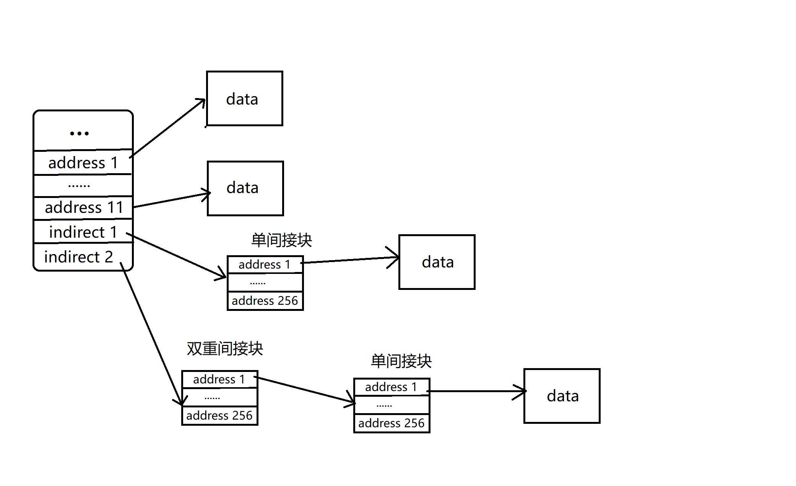
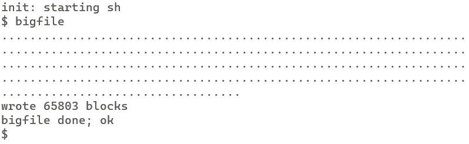
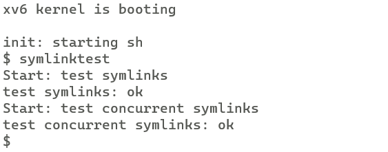
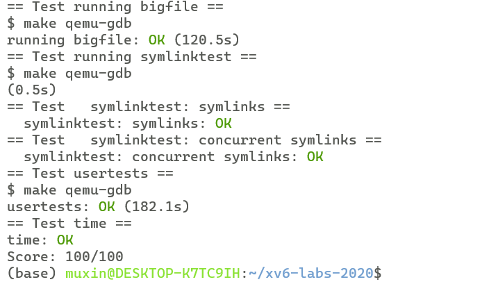

# xv6 labs
## **lab9**:file systme
### **Exercise1** Large files

**任务：**
目前 xv6 文件限制为 268 个块即 268*BSIZE 字节（xv6 中 BSIZE 为 1024）。这个限制来自于一个xv6 inode包含12个直接块号和一个单间接块号，它指向一个最多可以容纳256个块号的块，总共12+256=268块。

现在需要修改文件系统，让inode中有一个双重间接块，该双重间接块包含256个单间接块地址，修改后的文件系统每个文件最多可以包含65803（256*256+256+11）个块，牺牲了一个直接块号来作为双重间接块。

**实现：**

修改后的inode组织block如下图：、



我们首先修改fs.h中相关的宏定义：

```c
#define NDIRECT 11
#define NINDIRECT1 (BSIZE / sizeof(uint))
#define NINDIRECT2 (BSIZE*256/sizeof(uint))
#define MAXFILE (NDIRECT + NINDIRECT1 + NINDIRECT2)
```
NDIRECT变为11，新定义NINDIRECT1表示单间接块最多包含块的数量，NINDIRECT2表示双重间接块最多包含块的数量。MAXFILE为三者之和。

同时需要修改使用了这些宏定义的相关代码：
```c
struct dinode {
  // ...
  uint addrs[NDIRECT+2];   // Data block addresses
};
```
dinode中addrs原本大小为NDIRECT+1，修改为NDIRECT+2。
```c
struct inode {
  // ...
  uint addrs[NDIRECT+2];
};
```
同样修改inode中addrs的定义。

之后修改bmap函数，bmap函数实际上负责文件的逻辑块号到磁盘块号的映射。由于我们修改了文件块号的组织方式，因此需要相应修改bmap函数：

```c
static uint
bmap(struct inode *ip, uint bn)
{
  uint addr, *a;
  struct buf *bp;

  if(bn < NDIRECT){
    if((addr = ip->addrs[bn]) == 0)
      ip->addrs[bn] = addr = balloc(ip->dev);
    return addr;
  }
  bn -= (NDIRECT);

  if(bn < NINDIRECT1){
    // Load indirect block, allocating if necessary.
    if((addr = ip->addrs[NDIRECT]) == 0)
      ip->addrs[NDIRECT] = addr = balloc(ip->dev);
    bp = bread(ip->dev, addr);
    a = (uint*)bp->data;
    if((addr = a[bn]) == 0){
      a[bn] = addr = balloc(ip->dev);
      log_write(bp);
    }
    brelse(bp);
    return addr;
  }

  bn -= (NINDIRECT1);

  if(bn < NINDIRECT2){
    if((addr = ip->addrs[NDIRECT+1]) == 0)
      ip->addrs[NDIRECT+1] = addr = balloc(ip->dev);
    int bn1 = bn/256;
    int bn2 = bn%256;
    bp = bread(ip->dev,addr);
    a = (uint*)bp->data;
    if((addr = a[bn1]) == 0){
      a[bn1] = addr = balloc(ip->dev);
      log_write(bp);
    }
    brelse(bp);

    bp = bread(ip->dev,addr);
    a = (uint*)bp->data;
    if((addr = a[bn2]) == 0){
      a[bn2] = addr = balloc(ip->dev);
      log_write(bp);
    }
    brelse(bp);
    return addr;
  }

  panic("bmap: out of range");
}
```
相较于初始版本的bmap函数，我们需要多处理一种情况，也就是块号bn对应的是双重间接块对应范围内的块。

这种情况下我们首先需要判断双重间接块是否已分配，没有的话需要先分配，然后获得bn所属单间接块的地址。之后判断该单间接块是否已分配，没有的话需要进行分配，然后获取实际data块的地址。最后判断实际的data块分配了没有，没有的话需要进行分配。

在上述过程中记得要bread后进行相应的brelse。同时，如果修改了某些块对应的cache buf，需要log_write。

对于itrunc函数，也需要进行修改，保证能正确释放所有的块：
```c
void
itrunc(struct inode *ip)
{
  int i, j;
  struct buf *bp,*bp2;
  uint *a,*a2;

  for(i = 0; i < NDIRECT; i++){
    if(ip->addrs[i]){
      bfree(ip->dev, ip->addrs[i]);
      ip->addrs[i] = 0;
    }
  }

  if(ip->addrs[NDIRECT]){
    bp = bread(ip->dev, ip->addrs[NDIRECT]);
    a = (uint*)bp->data;
    for(j = 0; j < NINDIRECT1; j++){
      if(a[j])
        bfree(ip->dev, a[j]);
    }
    brelse(bp);
    bfree(ip->dev, ip->addrs[NDIRECT]);
    ip->addrs[NDIRECT] = 0;
  }

  if(ip->addrs[NDIRECT+1]){
    bp = bread(ip->dev,ip->addrs[NDIRECT+1]);
    a = (uint*)bp->data;
    for(j = 0;j<256;++j){
      if(a[j]){
        bp2 = bread(ip->dev,a[j]);
        a2 = (uint*)bp2->data;
        for(int k=0;k<256;++k){
          if(a2[k]){
            bfree(ip->dev,a2[k]);
          }
        }
        brelse(bp2);
        bfree(ip->dev,a[j]);
      }
    }
    brelse(bp);
    bfree(ip->dev,ip->addrs[NDIRECT+1]);
    ip->addrs[NDIRECT+1] = 0;
  }

  ip->size = 0;
  iupdate(ip);
}
```

对于属于双重间接块范围内的块，释放顺序为：先释放data块，然后释放组织data块的单间接块，最后释放组织单间接块的双重间接块。

**测试结果：**


### **Exercise2** Symbolic links

**任务：**

实现 symlink(char *target, char *path) 系统调用，该系统调用在path处创建一个符号链接，指向由 target 命名的文件。

**实现：**

关于系统调用的添加方法不再赘述。

我们需要在stat.h中添加新的文件类型T_SYMLINK：
```c
#define T_SYMLINK 4   //symbolic link
```
实现symlink系统调用的主体函数sys_symlink函数：
```c
uint64
sys_symlink(void)
{
  char target[MAXPATH];
  char path[MAXPATH];
  int n;
  if((n = argstr(0,target,MAXPATH)) < 0 || (n = argstr(1,path,MAXPATH)) < 0)
    return -1;
  begin_op();
  struct inode * ip = create(path,T_SYMLINK,0,0);
  if(ip==0){
    end_op();
    return -1;
  }
  
  if(writei(ip,0,(uint64)target,0,MAXPATH)<0){
    iunlockput(ip);
    end_op();
    return -1;
  }
  iunlockput(ip);
  end_op();
  return 0;
} 

```
sys_symlink传入两个参数target，path。使用create创建一个路径为path的，文件类型为T_SYMLINK的inode。

我们需要将target保存在新inode中，具体保存在inode的addr[0]指向的data块的最开始，其实也就是文件的最开始。

我们直接调用writei函数，将target写入到文件开头。这里需要注意，在调用完create后，在返回inode指针前已经对inode进行了ilock，因此不再需要进行ilock。在writei后进行iunlockput。

之后，由于我们新加了文件类型，因此需要修改open系统调用相关代码。首先，对于一个符号链接文件，open应该有两种选择，直接打开这个文件，或者是打开它链接的文件。因此需要给open的omode添加一个标志位O_NOFOLLOW，代表直接打开符号链接，而不是代开链接的文件：

```c
#define O_NOFOLLOW 0x800
```

之后修改open系统调用：
```c
uint64
sys_open(void)
{
  char path[MAXPATH];
  int fd, omode;
  struct file *f;
  struct inode *ip;
  int n;

  if((n = argstr(0, path, MAXPATH)) < 0 || argint(1, &omode) < 0)
    return -1;

  begin_op();

  if(omode & O_CREATE){
    ip = create(path, T_FILE, 0, 0);
    if(ip == 0){
      end_op();
      return -1;
    }
  } else {
    int follow_depth = 0;  //recode the follow depth of symlink
    while(1){
      if((ip = namei(path)) == 0){
        end_op();
        return -1;
      }
      ilock(ip);
      if(ip->type == T_SYMLINK && !(omode & O_NOFOLLOW)){
        if(follow_depth>10){
          iunlockput(ip);
          end_op();
          return -1;
        }
        else{
          if(readi(ip,0,(uint64)path,0,MAXPATH)<0){
            iunlockput(ip);
            end_op();
            return -1;
          }
          follow_depth++;
          iunlockput(ip);
        }
      }
      else{
        break;
      }
    }
    if(ip->type == T_DIR && omode != O_RDONLY){
      iunlockput(ip);
      end_op();
      return -1;
    }
  }

  // ...
}
```

对于一个symlink文件，如果标志不为O_NOFOLLOW，那么我们需要打开它链接的文件，并且，如果它链接的文件仍然是symlink，那么我们需要递归地打开链接的文件。为了防止链接循环，我们设置一个阈值，当链接的递归层次超过阈值则认为出错。

用follow_depth来维护follow的深度。在while循环里，我们不断地通过readi读取symlink的inode中存储的文件路径来作为新的文件，并增加follow_depth，直到新文件不是symlink文件，或者follow深度超过阈值才退出循环。

**测试结果：**



**make grade 结果：**

